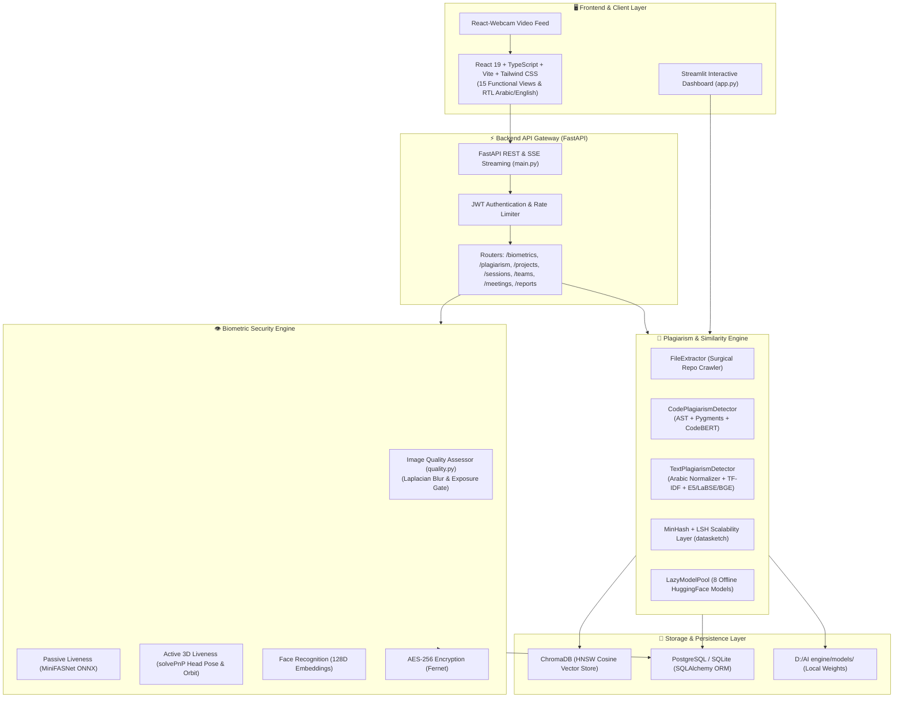
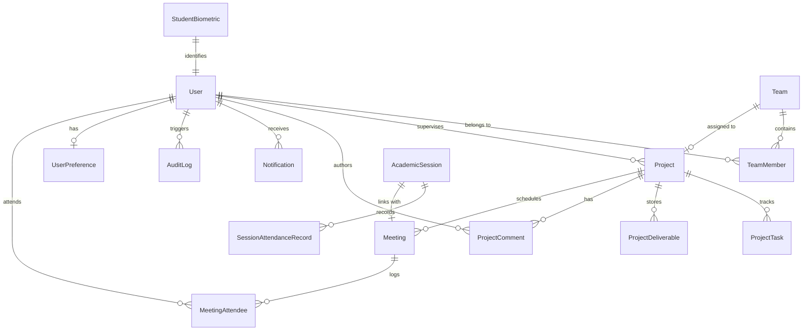

# 🛡️ Secure-FEPRH: System Architecture & Codebase Analysis Report

**System Name:** Secure-FEPRH (Academic Management & AI Biometric Security Platform)  
**Target Root:** `D:\AI engine\`  
**Date:** August 2026  
**Document Version:** 1.0.0  

---

## 📋 Executive Summary

**Secure-FEPRH** is an enterprise-grade academic management, authentication, and similarity verification system designed for higher education institutions. The platform integrates two primary AI engines:
1. **AI Biometric Security & Attendance Engine:** Prevents identity fraud through 3D active/passive liveness detection, facial recognition, and AES-256 encrypted vector storage.
2. **AI Multilingual Code & Document Plagiarism Detection Engine:** Detects structural and semantic duplication across programming projects and academic documents using Abstract Syntax Trees (AST), CodeBERT, multilingual NLP models, and MinHash/LSH indexing.

The architecture comprises a **FastAPI** backend with **SQLAlchemy ORM** (supporting SQLite and PostgreSQL), a **React 19 / TypeScript / Vite / Tailwind CSS** frontend, and a standalone **Streamlit** dashboard.

---

## 🏗️ High-Level System Architecture

---

## 🧩 1. Deep Dive: Subsystems & Methods Used

### A. AI Biometric Security & Attendance Engine (`biometric_security_engine/`)

Located at `biometric_security_engine/`, this subsystem verifies identity while preventing presentation attacks (screen replays, printed photographs, 2D masks):

1. **Image Quality Assessment (IQA Gate - `quality.py`)**:
   - Evaluates frame sharpness using **Laplacian Variance**:
     $$\text{Var}(\Delta I) = \sigma^2(\nabla^2 I)$$
   - Rejects frames with blur score $< 35.0$, under-exposed frames ($< 30$ mean grayscale), over-exposed frames ($> 245$ mean grayscale), or faces smaller than 80px bounding box.

2. **Passive Anti-Spoofing Liveness (`liveness.py`)**:
   - Uses an ONNX neural network (**MiniFASNet**) via `cv2.dnn.readNetFromONNX`.
   - Analyzes micro-textures, specular reflections, and 3D depth gradients from a 2D camera feed.
   - Provides a heuristic fallback based on Laplacian variance when ONNX weights are not loaded.

3. **Active 3D Liveness & Head Pose Estimation**:
   - Employs the **Perspective-n-Point (`cv2.solvePnP`)** algorithm.
   - Maps 2D facial landmarks (nose tip, chin, eye corners, mouth corners) to standard 3D anthropometric face model coordinates (`MODEL_POINTS_3D`).
   - Computes Rodrigues rotation vectors and converts them to 3D Euler angles (**Pitch, Yaw, Roll**).
   - Validates interactive challenges like `TURN_LEFT`, `TURN_RIGHT`, `LOOK_UP`, `LOOK_DOWN`, and continuous circular orbital motion.

4. **128D Facial Recognition (`face_engine.py`)**:
   - Extracts 128-dimensional deep metric embeddings using dlib / FaceNet models.
   - Computes Euclidean distance between embeddings:
     $$d(u, v) = \|u - v\|_2$$
   - Enforces a strict tolerance threshold ($\le 0.45$) to eliminate false matches.

5. **Biometric Data Protection & Privacy**:
   - Raw face photos are discarded immediately after feature extraction.
   - 128D embedding vectors are serialized and encrypted using **AES-256 in CBC mode with HMAC authentication** via `cryptography.fernet.Fernet` before storage in the database.

---

### B. AI Plagiarism & Code Similarity Engine (`plagiarism_engine/`)

Located at `plagiarism_engine/`, this subsystem analyzes semantic and structural similarities across source code and natural language documents:

1. **Surgical Repository Crawler (`extractor.py`)**:
   - Traverses directories while filtering out over 95% of boilerplate files (`node_modules`, `.git`, `dist`, `build`, `.dart_tool`, `Pods`, `__pycache__`).
   - Categorizes files into **Code** (`.py`, `.dart`, `.cpp`, `.java`, `.js`, `.ts`, `.cs`, `.go`, `.rs`, `.php`, etc.) and **Documents** (`.pdf`, `.docx`, `.md`, `.txt`).
   - Extracts text and structural metadata using `pypdf` and `python-docx`.

2. **Code Plagiarism Detection (`code_detector.py`)**:
   - **Pygments Lexical Tokenizer**: Replaces variable names and literals with generic markers (`ID`, `STR`, `NUM`, `K:def`, `O:+`), stripping comments and whitespace.
   - **Python AST Sequence Matcher**: Parses Python code into Abstract Syntax Trees using Python's `ast` module (`ast.walk`) to capture structural logic regardless of variable renaming.
   - **Neural CodeBERT Embeddings**: Encodes code snippets with Microsoft's `codebert-base` model.
   - **$O(1)$ Bounded Complexity**: Caps token sequence matching at 1,500 tokens (`fp[:1500]`), preventing $O(N^2)$ freezing on monorepos.
   - **Hybrid Composite Formula**:
     $$\text{Similarity}_{\text{Code}} = 0.5 \times \text{AST/Token Ratio} + 0.5 \times \text{CosineSim}(\text{CodeBERT}_1, \text{CodeBERT}_2)$$

3. **Multilingual NLP Document Scanner (`text_detector.py`)**:
   - **Arabic Text Normalization**: Regex-based stripping of Tashkeel (diacritics: `[\u064B-\u0652\u0640]`), Tatweel, and normalization of Alef variants (`أ, إ, آ -> ا`), Teh Marbuta (`ة -> ه`), and Alef Maqsura (`ى -> ي`).
   - **TF-IDF & Character N-Grams**: Extracts top keywords and computes character-level N-gram similarity (`char_wb`).
   - **Weighted Composite Score**:
     $$\text{Similarity}_{\text{Text}} = 0.30 \times \text{Title Sim} + 0.30 \times \text{Keywords Sim} + 0.40 \times \text{Body Sim}$$

4. **MinHash + LSH Scalability Layer (`minhash_index.py`)**:
   - For large-scale corpora (10,000+ documents), brute-force $O(N^2)$ comparisons become impractical.
   - Generates 128-permutation MinHash signatures and indexes them into Locality-Sensitive Hashing (LSH) buckets via `datasketch`.
   - Queries return candidate pairs in sub-linear $O(N)$ time.

5. **Task-Based `LazyModelPool` & Vector Store (`vector_store.py`)**:
   - Dispatches tasks to 8 locally stored offline HuggingFace models:
     - `codebert-base` (Source code understanding)
     - `bge-m3` (Long papers up to 8,192 tokens)
     - `LaBSE` (Cross-lingual Arabic ↔ English matching across 109+ languages)
     - `arabertv02` (Arabic morphology & roots)
     - `multilingual-e5-large` / `base` (High-precision document ranking)
     - `paraphrase-multilingual-MiniLM-L12-v2` (Paraphrase detection)
     - `all-MiniLM-L6-v2` (Fast candidate triage)
   - Persistent vector storage powered by **ChromaDB** with isolated collections (`chroma_code_db` vs `chroma_multilingual_docs_db`).

---

## 📦 2. Comprehensive Packages & Libraries Directory

### Backend & AI Libraries (Python)

| Package | Version / Source | Primary Role in System |
|---|---|---|
| `fastapi` | `^0.115.4` | Asynchronous REST API framework, dependency injection, and SSE streaming. |
| `uvicorn` | `^0.32.0` | High-performance ASGI web server. |
| `pydantic` | `^2.9.2` | Data validation, request/response serialization, and settings parsing. |
| `opencv-python` | `^4.10.0` | Video frame manipulation, DNN ONNX model inference, 3D `solvePnP` pose estimation, Laplacian blur analysis. |
| `face_recognition` / `dlib` | `^1.3.0` | HOG-based face localization, 68 facial landmark extraction, and 128D facial embeddings. |
| `sentence-transformers` | `^2.2.2` | Loading and running local HuggingFace embedding models (`codebert`, `bge-m3`, `LaBSE`, `e5`, `arabert`). |
| `torch` | PyTorch backend | Tensor operations, GPU/CPU neural network inference. |
| `chromadb` | `^0.4.0` | Persistent vector database using HNSW indexing and Cosine distance. |
| `scikit-learn` | `^1.2.0` | TF-IDF Vectorization, N-gram feature extraction, and Cosine similarity matrix math. |
| `datasketch` | Python package | MinHash signatures and Locality-Sensitive Hashing (LSH) for large-scale candidate pruning. |
| `pypdf` | `^3.0.0` | Extracting raw text, headings, and structure from PDF documents. |
| `python-docx` | `^0.8.11` | Extracting paragraphs and tables from Word documents (`.docx`). |
| `pygments` | `^2.14.0` | Language-agnostic code lexing, syntax analysis, and structural token fingerprinting. |
| `sqlalchemy` | `^2.0` | Relational Object-Relational Mapper (ORM) for managing all database entities. |
| `psycopg2-binary` | `^2.9.0` | Native PostgreSQL driver for relational storage. |
| `cryptography` | Standard package | `Fernet` AES-256 encryption for biometric vectors at rest. |
| `pyjwt` | Python package | Generating and validating stateless JWT bearer tokens for RBAC. |
| `streamlit` | `^1.30` | Standalone UI for instant cross-scanning, model diagnostics, and log streaming. |

---

### Frontend Libraries (React 19 / TypeScript)

| Package | Version | Purpose in Application |
|---|---|---|
| `react` & `react-dom` | `^19.0.1` | Core reactive UI framework. |
| `react-router-dom` | `^7.18.1` | Client-side routing across all 15 application views. |
| `vite` | `^6.2.3` | Fast ESM build tool and development server. |
| `tailwindcss` | `^4.1.14` | Utility-first responsive CSS styling with dark/light mode support. |
| `framer-motion` / `motion` | `^12.42.2` | Animations, modal transitions, and biometric scanning animations. |
| `react-webcam` | `^7.2.0` | Direct browser webcam video capture for biometric enrollment and attendance. |
| `lucide-react` | `^0.546.0` | Comprehensive iconography. |
| `recharts` | `^3.10.1` | Analytics charts, attendance trends, and plagiarism similarity distributions. |
| `i18next` & `react-i18next` | `^26.3.6` | Bilingual English / Arabic internationalization with dynamic RTL flipping. |
| `jspdf` & `html2canvas` | `^4.2.1` | Client-side PDF audit report generation. |
| `react-hot-toast` | `^2.6.0` | Toast notifications for async operations. |

---

## 🗄️ 3. Database Architecture & Schema

The relational layer is managed via **SQLAlchemy ORM** with dual support for **SQLite** (local embedded) and **PostgreSQL**:

### Key Entities in `biometric_security_engine/api/database/models.py`:
1. **`User`**: Core identity model supporting 7 roles (`Ministry Admin`, `University Admin`, `Supervisor`, `Student`, `Faculty Member`, `Administrative Staff`, `Security Personnel`).
2. **`StudentBiometric`**: Stores student IDs alongside encrypted 128D face vectors.
3. **`AcademicSession` & `SessionAttendanceRecord`**: Manages classroom/defense sessions and per-student verification methods (`3D Biometric`, `Fast Face ID`, `Manual`).
4. **`Project`, `ProjectTask`, `ProjectDeliverable`**: Full Kanban task board and graduation project management.
5. **`PlagiarismScanReport`**: Detailed audit trail of comparisons, similarity scores, and execution logs.
6. **`AuditLog` & `Notification`**: System telemetry, IP logging, and real-time user notifications.

---

## 📊 4. Summary of Algorithmic Approaches

| Domain | Problem | Technique / Algorithm | Advantage Over Traditional Tools |
|---|---|---|---|
| **Liveness** | 2D Screen / Paper Spoofing | MiniFASNet CNN + Laplacian Variance | Blocks attacks before identity matching begins. |
| **Active Verification** | Static Photo / Video Loops | 3D Perspective-n-Point (`solvePnP`) Pose | Tracks real 3D head rotation angles in real time. |
| **Biometric Privacy** | Storage of Sensitive Photos | 128D Embedding + AES-256 Encryption | Raw images are discarded; vectors are encrypted at rest. |
| **Code Plagiarism** | Renamed Variables & Shuffled Code | AST Sequence Parsing + Pygments Tokenization | Compares execution logic structure rather than text tokens. |
| **Code Semantics** | Semantic Re-implementation | Microsoft `CodeBERT` Vector Embeddings | Captures algorithmic meaning beyond syntax similarities. |
| **Multilingual NLP** | Arabic Morphological Variance | Custom Regex Normalizer (Tashkeel / Alef) | Neutralizes Arabic orthographic and dialectal variations. |
| **Cross-Lingual Copying** | Translated Plagiarism (Ar ↔ En) | Google `LaBSE` Dual-Aligned Vectors | Matches Arabic text with English translations. |
| **Large-Scale Search** | $O(N^2)$ Pairwise Bottleneck | `datasketch` MinHash + LSH Indexing | Reduces billions of comparisons to sub-linear candidate queries. |

---

*Report Generated and Persisted locally in `D:\AI engine\SYSTEM_ARCHITECTURE_AND_CODEBASE_ANALYSIS.md`.*
