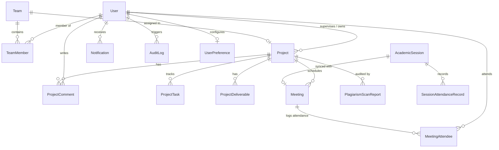

# Comprehensive System Architecture, Database Schema Audit & Master Implementation Plan

**Generated for:** AI Biometric Security & Academic Graduation Project Platform  
**Target Environment:**
- **Backend:** `D:\AI engine\biometric_security_engine\api\main.py`
- **Database:** `D:\AI engine\biometric_security_engine\biometric_security.db` (and `biometric_db.sqlite`)
- **Frontend Client:** `D:\AI engine\frontend\src\lib\api.ts`
- **Frontend Pages:** `CommandCenter.tsx`, `Projects.tsx`, `ProjectDetail.tsx`, `Teams.tsx`, `Meetings.tsx`, `UserManagement.tsx`, `AddUser.tsx`, `Settings.tsx`, `Reports.tsx`, `SessionManagement.tsx`, `Attendance.tsx`, `Plagiarism.tsx`, `Topbar.tsx`, `MainLayout.tsx`

---

## Table of Contents
1. [Executive Summary](#1-executive-summary)
2. [Frontend Interaction & Page-by-Page Audit](#2-frontend-interaction--page-by-page-audit)
3. [Database Schema & SQLAlchemy Models Specification](#3-database-schema--sqlalchemy-models-specification)
4. [API Architecture & REST Endpoints Specification](#4-api-architecture--rest-endpoints-specification)
5. [RBAC & Security Permissions Matrix](#5-rbac--security-permissions-matrix)
6. [Master Implementation Roadmap](#6-master-implementation-roadmap)

---

## 1. Executive Summary

A comprehensive, end-to-end audit was performed across all 15 frontend pages, layout components, the FastAPI backend (`main.py`), and the SQLite relational databases (`biometric_security.db` and `biometric_db.sqlite`).

### Current Status Matrix
| Category | Total Required | Fully Connected & Active | Partially Connected / In-Memory | Missing / 100% Mock / Dead-End |
| :--- | :---: | :---: | :---: | :---: |
| **Database Tables** | 14 Tables | 4 Tables (`users`, `academic_sessions`, `session_attendance_records`, `project_comments`) | 0 | **10 Tables Missing** |
| **API Route Modules** | 9 Modules | 3 Modules (Auth & Biometrics, Sessions, Plagiarism) | 2 Modules (Users, Comments) | **4 Modules Missing** (Teams, Meetings, Projects & Kanban, Settings/Logs/Notifications) |
| **Frontend UI Pages** | 15 Pages | 4 Pages (Login, Register, Attendance, Plagiarism) | 3 Pages (Meetings, User Mgmt, Sessions) | **8 Pages Disconnected / Mock** |

---

## 2. Frontend Interaction & Page-by-Page Audit

### 2.1 Meetings Management (`Meetings.tsx` & `MainLayout.tsx`)
- **What Works:**
  - Dynamic loading of academic sessions via `sessionsApi.getAll()` and student rosters via `sessionsApi.getRoster(id)`.
  - Expanding the accordion reveals real-time biometric verification indicators and timestamps.
- **Dead-Ends & Missing Items:**
  - **"Create Meeting" (`Cmd+N`):** Dispatches `open-new-meeting-modal` to `MainLayout.tsx`. The modal opens, but its inputs are uncontrolled, and clicking **"Schedule Meeting" merely closes the modal without persisting data or calling the backend**.
  - **Missing Meeting Actions:** No buttons to edit meeting details, cancel/delete meetings, or manually verify attendance.

### 2.2 Teams Directory (`Teams.tsx`)
- **Status: 100% Mock Data.**
  - Initializes with a static 6-item array (`TEAM_MEMBERS`).
- **Dead-Ends & Missing Items:**
  - **Missing "Create Team" / "Add Member" Button:** No button or modal exists to create a team or add new members.
  - **Search Input:** Uncontrolled input; typing does not filter members.
  - **3-Dots Menu (`MoreHorizontal`):** Dropdown renders, but the buttons (**"Edit Profile"**, **"Suspend User"**, **"Remove"**) have **no `onClick` handlers** and do nothing.
  - **No Project Linking:** Members cannot be assigned to projects or departments.

### 2.3 Projects & Kanban Board (`Projects.tsx` & `ProjectDetail.tsx`)
- **Status: 100% Mock Data.**
  - Uses `INITIAL_PROJECTS` constant array.
- **Dead-Ends & Missing Items:**
  - **"New Project" Button:** Has no `onClick` handler (no modal opens).
  - **Kanban Drag-and-Drop:** Status changes only in local React component state; page refresh resets the board.
  - **Comments Drawer:** Bound to `commentText` state, but clicking **"Send" has no handler** and does not call `usersApi.addComment`.
  - **`ProjectDetail.tsx`:** Ignores the `:id` URL parameter and always renders "AI-Powered Attendance System".
  - **Action Buttons:** "Edit Project", "Upload File", and "+ Add Task" are dead-ends without handlers.

### 2.4 User Administration & Provisioning (`UserManagement.tsx` & `AddUser.tsx`)
- **What Works:** Fetches and displays registered users from `GET /api/users`.
- **Dead-Ends & Missing Items:**
  - **Slide-over Drawer "Provision Account":** Inputs are uncontrolled; clicking "Provision Account" closes the drawer without calling `usersApi.provision`.
  - **`AddUser.tsx` (`/users/add`):** Simulates submission with a mock `setTimeout` and navigates to `/users` without calling the API.
  - **Status Toggle:** Flips active/inactive locally in React state without persisting to SQLite.
  - **Table Actions:** "Edit" button (`Edit2`) has no handler; delete user functionality is missing.

### 2.5 Settings & Activity History (`Settings.tsx`)
- **Status: 100% Mock Data.**
- **Dead-Ends & Missing Items:**
  - **Profile Card:** Hardcoded "Dr. Ahmed Hassan"; "Edit Profile" does nothing.
  - **Change Password:** Uncontrolled inputs; "Update Password" has `type="button"` and no handler.
  - **Notification Toggles:** Static `<div>` elements with fixed styling; completely non-interactive.
  - **Activity Logs:** Static 4-row array; "Export Logs" button does nothing.

### 2.6 Reports & Telemetry (`Reports.tsx` & `CommandCenter.tsx`)
- **Status: 100% Mock Data.**
  - All chart datasets (project completion, attendance trends, team activity) render hardcoded arrays.
  - Refresh button runs a simulated 800ms spinner without querying backend analytics.
  - `ResourceMonitor.tsx` generates client-side `Math.random()` jitter instead of live server metrics.

### 2.7 Topbar & Layout (`Topbar.tsx` & `MainLayout.tsx`)
- **Search Bar:** Filters a hardcoded 4-item array (`allSearchResults`) rather than querying backend entities.
- **Notifications Dropdown:** 4 hardcoded static alerts. "Mark all as read" only closes the menu without persisting state.
- **User Profile Pill:** Displays hardcoded "Admin User" / "Ministry Admin" with no profile dropdown or logout option.

---

## 3. Database Schema & SQLAlchemy Models Specification



### 3.1 Existing Models in `main.py`
1. **`User`** (`users`): `id` (PK, Int), `email` (Unique), `hashed_password`, `full_name`, `role`, `department`, `university`, `status`, `created_at`.
2. **`AcademicSession`** (`academic_sessions`): `id` (PK, Str), `course_code`, `course_name`, `session_type`, `room`, `date`, `time_range`, `grace_period`, `enrolled`, `status`, `created_at`.
3. **`SessionAttendanceRecord`** (`session_attendance_records`): `id` (PK, Int), `session_id` (FK `academic_sessions.id`), `student_id`, `student_name`, `status`, `verification_method`, `confidence`, `timestamp`.
4. **`ProjectComment`** (`project_comments`): `id` (PK, Int), `project_id` (Str), `user_id` (FK `users.id`), `content`, `created_at`.
5. **`PlagiarismScanReport`** (`plagiarism_scan_reports`): `id` (PK, Str), `project_name`, `scan_type`, `overall_similarity`, `code_similarity`, `text_similarity`, `verdict`, `total_files`, `total_loc`, `comparisons_json`, `logs_json`, `created_at`.

---

### 3.2 Complete Code Definitions for New SQLAlchemy Models

```python
from sqlalchemy import Column, Integer, String, Text, Float, Boolean, ForeignKey, DateTime as SADateTime
from sqlalchemy.sql import func
from sqlalchemy.orm import relationship

# 1. PROJECT MODEL
class Project(Base):
    __tablename__ = "projects"
    
    id = Column(String(50), primary_key=True, index=True)  # e.g., "PRJ-001"
    title = Column(String(255), nullable=False, index=True)
    abstract = Column(Text, nullable=True)
    domain = Column(String(100), nullable=False)  # "AI/ML", "Cybersecurity", "Web Dev", "IoT", "Data Science"
    status = Column(String(50), default="Proposed", index=True)  # "Proposed", "Approved", "In Progress", "Completed", "Archived"
    supervisor_id = Column(Integer, ForeignKey("users.id", ondelete="SET NULL"), nullable=True)
    supervisor_name = Column(String(150), default="Dr. Ahmed Hassan")
    team_id = Column(Integer, ForeignKey("teams.id", ondelete="SET NULL"), nullable=True)
    department = Column(String(150), default="Computer Science Dept.")
    university = Column(String(150), default="Cairo University")
    academic_year = Column(String(50), default="2024/2025")
    progress_percentage = Column(Float, default=0.0)
    created_at = Column(SADateTime(timezone=True), server_default=func.now())
    updated_at = Column(SADateTime(timezone=True), onupdate=func.now())

    supervisor = relationship("User", foreign_keys=[supervisor_id])
    team = relationship("Team", back_populates="project")
    tasks = relationship("ProjectTask", back_populates="project", cascade="all, delete-orphan")
    deliverables = relationship("ProjectDeliverable", back_populates="project", cascade="all, delete-orphan")
    comments = relationship("ProjectComment", backref="project_ref", cascade="all, delete-orphan")
    meetings = relationship("Meeting", back_populates="project", cascade="all, delete-orphan")


# 2. TEAM MODEL
class Team(Base):
    __tablename__ = "teams"
    
    id = Column(Integer, primary_key=True, autoincrement=True)
    name = Column(String(150), nullable=False, unique=True)
    description = Column(Text, nullable=True)
    department = Column(String(150), default="Computer Science")
    university = Column(String(150), default="Cairo University")
    color_gradient = Column(String(100), default="from-indigo-500 to-purple-600")
    leader_id = Column(Integer, ForeignKey("users.id", ondelete="SET NULL"), nullable=True)
    created_at = Column(SADateTime(timezone=True), server_default=func.now())

    leader = relationship("User", foreign_keys=[leader_id])
    members = relationship("TeamMember", back_populates="team", cascade="all, delete-orphan")
    project = relationship("Project", back_populates="team", uselist=False)


# 3. TEAM MEMBER MAPPING
class TeamMember(Base):
    __tablename__ = "team_members"
    
    id = Column(Integer, primary_key=True, autoincrement=True)
    team_id = Column(Integer, ForeignKey("teams.id", ondelete="CASCADE"), nullable=False, index=True)
    user_id = Column(Integer, ForeignKey("users.id", ondelete="CASCADE"), nullable=False, index=True)
    role_in_team = Column(String(50), default="Member")  # "Leader", "Member", "System Architect", "UI/UX Designer"
    phone = Column(String(50), nullable=True)
    initials = Column(String(10), nullable=True)
    joined_at = Column(SADateTime(timezone=True), server_default=func.now())

    team = relationship("Team", back_populates="members")
    user = relationship("User")


# 4. KANBAN BOARD TASK
class ProjectTask(Base):
    __tablename__ = "project_tasks"
    
    id = Column(Integer, primary_key=True, autoincrement=True)
    project_id = Column(String(50), ForeignKey("projects.id", ondelete="CASCADE"), nullable=False, index=True)
    title = Column(String(255), nullable=False)
    description = Column(Text, nullable=True)
    status = Column(String(50), default="To Do")  # "To Do", "In Progress", "In Review", "Done"
    priority = Column(String(20), default="Medium")  # "Low", "Medium", "High", "Critical"
    category = Column(String(50), default="General")
    assignee_id = Column(Integer, ForeignKey("users.id", ondelete="SET NULL"), nullable=True)
    order_index = Column(Integer, default=0)
    created_at = Column(SADateTime(timezone=True), server_default=func.now())

    project = relationship("Project", back_populates="tasks")
    assignee = relationship("User")


# 5. PROJECT DELIVERABLE / FILE
class ProjectDeliverable(Base):
    __tablename__ = "project_deliverables"
    
    id = Column(Integer, primary_key=True, autoincrement=True)
    project_id = Column(String(50), ForeignKey("projects.id", ondelete="CASCADE"), nullable=False, index=True)
    name = Column(String(255), nullable=False)
    file_path = Column(String(500), nullable=False)
    file_size = Column(String(50), nullable=True)
    file_type = Column(String(50), nullable=True)
    uploader_id = Column(Integer, ForeignKey("users.id", ondelete="SET NULL"), nullable=True)
    uploaded_at = Column(SADateTime(timezone=True), server_default=func.now())

    project = relationship("Project", back_populates="deliverables")
    uploader = relationship("User")


# 6. MEETING MODEL
class Meeting(Base):
    __tablename__ = "meetings"
    
    id = Column(Integer, primary_key=True, autoincrement=True)
    title = Column(String(255), nullable=False)
    project_id = Column(String(50), ForeignKey("projects.id", ondelete="CASCADE"), nullable=True, index=True)
    session_id = Column(String(50), ForeignKey("academic_sessions.id", ondelete="SET NULL"), nullable=True)
    date = Column(String(50), nullable=False)
    time_range = Column(String(100), default="10:00 AM - 11:30 AM")
    room = Column(String(100), default="Auditorium 3B")
    notes = Column(Text, nullable=True)
    status = Column(String(50), default="unverified")  # "verified", "partial", "unverified"
    created_by = Column(Integer, ForeignKey("users.id", ondelete="SET NULL"), nullable=True)
    created_at = Column(SADateTime(timezone=True), server_default=func.now())

    project = relationship("Project", back_populates="meetings")
    session = relationship("AcademicSession")
    attendees = relationship("MeetingAttendee", back_populates="meeting", cascade="all, delete-orphan")


# 7. MEETING ATTENDEE RECORD
class MeetingAttendee(Base):
    __tablename__ = "meeting_attendees"
    
    id = Column(Integer, primary_key=True, autoincrement=True)
    meeting_id = Column(Integer, ForeignKey("meetings.id", ondelete="CASCADE"), nullable=False, index=True)
    user_id = Column(Integer, ForeignKey("users.id", ondelete="SET NULL"), nullable=True)
    student_name = Column(String(150), nullable=False)
    student_id = Column(String(100), nullable=True)
    is_verified = Column(Integer, default=0)
    verification_method = Column(String(50), default="3D Biometric")
    confidence = Column(String(50), default="99.4%")
    timestamp = Column(String(100), default="--")

    meeting = relationship("Meeting", back_populates="attendees")
    user = relationship("User")


# 8. USER PREFERENCES
class UserPreference(Base):
    __tablename__ = "user_preferences"
    
    id = Column(Integer, primary_key=True, autoincrement=True)
    user_id = Column(Integer, ForeignKey("users.id", ondelete="CASCADE"), unique=True, nullable=False)
    theme = Column(String(20), default="dark")
    language = Column(String(10), default="en")
    notif_plagiarism_alerts = Column(Integer, default=1)
    notif_meeting_reminders = Column(Integer, default=1)
    notif_project_updates = Column(Integer, default=0)
    updated_at = Column(SADateTime(timezone=True), onupdate=func.now())

    user = relationship("User", backref=relationship("UserPreference", uselist=False))


# 9. NOTIFICATIONS
class Notification(Base):
    __tablename__ = "notifications"
    
    id = Column(Integer, primary_key=True, autoincrement=True)
    user_id = Column(Integer, ForeignKey("users.id", ondelete="CASCADE"), nullable=True, index=True)
    title = Column(String(200), nullable=False)
    description = Column(Text, nullable=False)
    notif_type = Column(String(50), default="info")  # "alert", "info", "success", "warning"
    is_read = Column(Integer, default=0)
    link_route = Column(String(255), nullable=True)
    created_at = Column(SADateTime(timezone=True), server_default=func.now(), index=True)


# 10. AUDIT LOGS
class AuditLog(Base):
    __tablename__ = "audit_logs"
    
    id = Column(Integer, primary_key=True, autoincrement=True)
    user_id = Column(Integer, ForeignKey("users.id", ondelete="SET NULL"), nullable=True)
    user_name = Column(String(150), default="System")
    action = Column(String(255), nullable=False)
    details = Column(Text, nullable=True)
    ip_address = Column(String(50), default="127.0.0.1")
    created_at = Column(SADateTime(timezone=True), server_default=func.now(), index=True)
```

---

## 4. API Architecture & REST Endpoints Specification

### 4.1 Endpoints Specification by Feature Module

#### Module A: Teams & Directory Management (`/api/teams`)
| Method | Route | Description | Request Body | Response |
| :--- | :--- | :--- | :--- | :--- |
| `GET` | `/api/teams` | List all teams with nested members & project links | None | `{ teams: TeamItem[] }` |
| `POST` | `/api/teams` | Create a new team with leader and assigned members | `{ name, department, leader_id, color_gradient }` | `{ status: "success", team: TeamItem }` |
| `GET` | `/api/teams/{id}` | Get single team details & full member directory | None | `{ team: TeamDetail }` |
| `PUT` | `/api/teams/{id}` | Update team name, department, or leader | `{ name?, department?, leader_id? }` | `{ status: "success" }` |
| `DELETE` | `/api/teams/{id}` | Delete a team | None | `{ status: "success" }` |
| `POST` | `/api/teams/{id}/members` | Add a member to a team | `{ user_id, role_in_team, phone }` | `{ status: "success", member: TeamMemberItem }` |
| `DELETE` | `/api/teams/{id}/members/{user_id}` | Remove a member from a team | None | `{ status: "success" }` |

#### Module B: Meetings & Attendance Sync (`/api/meetings`)
| Method | Route | Description | Request Body | Response |
| :--- | :--- | :--- | :--- | :--- |
| `GET` | `/api/meetings` | List all scheduled/past meetings with attendee verification stats | None | `{ meetings: MeetingItem[] }` |
| `POST` | `/api/meetings` | Schedule a new meeting from Modal / `Cmd+N` | `{ title, project_id, date, time_range, room, notes, attendees: [] }` | `{ status: "success", meeting: MeetingItem }` |
| `GET` | `/api/meetings/{id}` | Get meeting details and attendee roster | None | `{ meeting: MeetingDetail }` |
| `PUT` | `/api/meetings/{id}` | Update meeting agenda, room, or timing | `{ title?, date?, time_range?, room?, notes? }` | `{ status: "success" }` |
| `DELETE` | `/api/meetings/{id}` | Cancel/delete a meeting | None | `{ status: "success" }` |
| `POST` | `/api/meetings/{id}/verify` | Verify individual attendee | `{ student_id, method, confidence }` | `{ status: "success" }` |

#### Module C: Projects, Tasks & Deliverables (`/api/projects`)
| Method | Route | Description | Request Body | Response |
| :--- | :--- | :--- | :--- | :--- |
| `GET` | `/api/projects` | Filterable project list (status, domain, dept) | `?status=...&domain=...` | `{ projects: ProjectItem[] }` |
| `POST` | `/api/projects` | Create a new project proposal | `{ title, abstract, domain, supervisor_id, dept, year }` | `{ status: "success", project: ProjectItem }` |
| `GET` | `/api/projects/{id}` | Get full project detail with tasks, comments, deliverables | None | `{ project: ProjectDetail }` |
| `PUT` | `/api/projects/{id}` | Update project metadata | `{ title?, abstract?, domain?, supervisor_id? }` | `{ status: "success" }` |
| `PATCH` | `/api/projects/{id}/status`| Update Kanban project status ("Proposed" ➔ "Approved" ➔ "In Progress" ➔ "Completed") | `{ status: string }` | `{ status: "success" }` |
| `DELETE` | `/api/projects/{id}` | Delete a project | None | `{ status: "success" }` |
| `GET` | `/api/projects/{id}/tasks` | Get project Kanban tasks | None | `{ tasks: TaskItem[] }` |
| `POST` | `/api/projects/{id}/tasks` | Create a new Kanban task | `{ title, description, status, priority, category, assignee_id }` | `{ status: "success", task: TaskItem }` |
| `PUT` | `/api/projects/{id}/tasks/{task_id}` | Update task lane/status or priority | `{ status?, priority?, assignee_id? }` | `{ status: "success" }` |
| `DELETE` | `/api/projects/{id}/tasks/{task_id}` | Remove a task | None | `{ status: "success" }` |

#### Module D: Settings & User Preferences (`/api/settings`)
| Method | Route | Description | Request Body | Response |
| :--- | :--- | :--- | :--- | :--- |
| `GET` | `/api/settings/me` | Get current user profile and preferences | None | `{ theme, language, notif_plagiarism_alerts, ... }` |
| `PUT` | `/api/settings/me` | Save theme, language, and notification settings | `{ theme?, language?, notif_plagiarism_alerts?, ... }` | `{ status: "success" }` |
| `POST` | `/api/settings/change-password` | Change account password | `{ current_password, new_password }` | `{ status: "success" }` |
| `GET` | `/api/settings/logs` | Fetch system and security audit logs | `?limit=50&offset=0` | `{ logs: AuditLogItem[] }` |

#### Module E: Reports & Analytics (`/api/reports`)
| Method | Route | Description | Request Body | Response |
| :--- | :--- | :--- | :--- | :--- |
| `GET` | `/api/reports/analytics` | Summary KPI cards (active users, reviews, attendance %, model health) | None | `{ active_users, pending_reviews, avg_attendance, model_health }` |
| `GET` | `/api/reports/completion-trends` | Monthly completion vs target trends | None | `{ data: TrendItem[] }` |
| `GET` | `/api/reports/attendance-trends` | Student vs supervisor weekly attendance | None | `{ data: AttendanceTrendItem[] }` |
| `GET` | `/api/reports/team-activity` | Weekly commits, reviews, issues breakdown | None | `{ data: TeamActivityItem[] }` |

#### Module F: Notifications & Alerts (`/api/notifications`)
| Method | Route | Description | Request Body | Response |
| :--- | :--- | :--- | :--- | :--- |
| `GET` | `/api/notifications` | Get user notifications & system alerts | None | `{ notifications: NotificationItem[] }` |
| `POST` | `/api/notifications/read-all` | Mark all notifications as read | None | `{ status: "success" }` |
| `PATCH` | `/api/notifications/{id}/read` | Mark single notification as read | None | `{ status: "success" }` |

---

## 5. RBAC & Security Permissions Matrix

### 5.1 Roles & Allowed Scopes
1. **Ministry Admin (National/Global Scope):** Full control across all universities, global projects, user provisioning, and national audit reports.
2. **University Admin (Institutional Scope):** Scoped to own University; manages departmental users, approves projects, views institutional analytics.
3. **Supervisor (Faculty/Academic Scope):** Scoped to assigned projects and academic sessions; schedules meetings, grades deliverables, runs plagiarism checks.
4. **Student (Individual & Team Scope):** Scoped to assigned team, enrolled sessions, and own project deliverables.

### 5.2 Granular Endpoint RBAC Table
| Endpoint Route | Ministry Admin | University Admin | Supervisor | Student | Scope Enforced |
| :--- | :---: | :---: | :---: | :---: | :--- |
| `GET /api/projects` | Full (All) | University Only | Assigned + Dept | Assigned Team | Auto-filtered by Role & Uni |
| `POST /api/projects` | Allowed | Allowed | Allowed | Proposal Only | Students create with status="Proposed" |
| `PATCH /api/projects/{id}/status` | Allowed | Allowed (Own Uni) | Allowed (Assigned) | Denied | Supervisors & Admins change status |
| `DELETE /api/projects/{id}` | Allowed | Allowed (Own Uni) | Denied | Denied | Protected destructive action |
| `GET /api/teams`, `POST /api/teams` | Allowed | Allowed | Allowed | View Only | Admins & Supervisors manage teams |
| `GET /api/meetings`, `POST /api/meetings` | Allowed | Allowed | Allowed | View / Join | Supervisors schedule meetings |
| `POST /api/sessions/{id}/clockin` | Allowed | Allowed | Allowed | Allowed (Self) | Verified student matches identity |
| `GET /api/users` | All Users | Uni Users | Dept Users | Peers Only | Directory scope |
| `POST /api/users/provision` | Allowed | Allowed (Dept/Uni) | Denied | Denied | User account creation |
| `PATCH /api/users/{id}/status` | Allowed | Allowed (Own Uni) | Denied | Denied | Account suspension/activation |

---

## 6. Master Implementation Roadmap

```
├── Step 1: Database Models & Auto-Seeding (main.py)
│   ├── Define 10 SQLAlchemy Models
│   ├── Execute Base.metadata.create_all(bind=rbac_engine)
│   └── Implement Seed Function (Initial realistic Projects, Teams, Meetings, Logs)
│
├── Step 2: FastAPI REST API Endpoints (main.py)
│   ├── Teams CRUD (/api/teams)
│   ├── Meetings CRUD (/api/meetings)
│   ├── Projects & Tasks CRUD (/api/projects)
│   ├── User Settings & Preferences (/api/settings)
│   ├── Reports & Analytics (/api/reports)
│   └── Notifications (/api/notifications)
│
├── Step 3: Frontend API Client Extension (api.ts)
│   ├── Export teamsApi, meetingsApi, projectsApi, settingsApi, reportsApi, notificationsApi
│   └── Add TypeScript interfaces for all responses
│
└── Step 4: Frontend UI Wiring & Interactive Modals
    ├── Meetings.tsx & MainLayout.tsx (Wire "Schedule Meeting" modal to API, add Edit/Delete)
    ├── Teams.tsx (Add "Create Team" modal, wire Search, Edit, Suspend, Remove)
    ├── Projects.tsx & ProjectDetail.tsx (Add "New Project" modal, wire Kanban drag-and-drop & Comments drawer, bind ProjectDetail :id)
    ├── UserManagement.tsx & AddUser.tsx (Wire Provision drawer & AddUser form to usersApi.provision, wire Status toggle)
    ├── Settings.tsx (Wire Password Change, Notification switches, live Activity Log)
    └── Topbar.tsx & CommandCenter.tsx (Wire notifications dropdown, live search, live KPI metrics)
```
