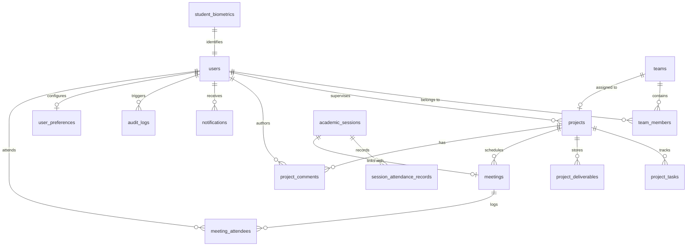

# مسودة الأطروحة الجامعية الكاملة: مشروع Secure-FEPRH
**نظام مستودع المشاريع الأكاديمية الوطني الآمن والمدعوم بالذكاء الاصطناعي**  
*(Secure Framework for Enterprise Project Repository in Higher-education)*

---

# بيانات الأطروحة والفصول التمهيدية

### [صفحة الغلاف المقترحة]
* **الجمهورية اليمنية — وزارة التعليم العالي والبحث العلمي**
* **جامعة إب — كلية الهندسة وتكنولوجيا المعلومات — قسم هندسة الحاسوب والتحكم**
* **عنوان المشروع:** تصميم وتطوير إطار عمل وطني مؤمن لمستودعات مشاريع التخرج بالجامعات مدعوم بالمصادقة البيومترية ثلاثية الأبعاد ومحركات كشف الانتحال الهجينة (Secure-FEPRH)
* **إعداد الطلاب:** [أسماء أعضاء الفريق]
* **إشراف الدكتور:** [اسم المشرف الأكاديمي]
* **العام الجامعي:** 2025 / 2026 م — 1447 هـ

---

### الإهداء (Dedication)
إلى ينابيع العطاء التي لم تنضب، إلى آبائنا وأمهاتنا الذين غرسوا فينا حب العلم وأناروا دروبنا بالدعاء والصبر...  
إلى جامعتنا وأساتذتنا الأجلاء الذين لم يبخلوا علينا بعلمٍ أو توجيه...  
إلى كل باحث وطالب يسعى لبناء غدٍ رقمي آمن لوطننا العزيز...  
نهدي هذا العمل المتواضع ثمرةً لسنوات الجد والاجتهاد.

---

### الشكر والتقدير (Acknowledgments)
نحمد الله العلي القدير الذي أعاننا ووفقنا لإتمام هذا العمل العلمي والتقني.  
نتقدم بأسمى آيات الشكر والعرفان إلى مشرفنا الأكاديمي الدكتور الفاضل/ [اسم المشرف] على رعايته الكريمة، وتوجيهاته القيمة، وصبره المستمر طوال فترة إنجاز هذا المشروع، والتي كانت البوصلة التي وجهت مسار بحثنا نحو التميز.  
كما نتقدم بخالص الشكر والتقدير إلى أعضاء الهيئة التدريسية بكلية الهندسة وتكنولوجيا المعلومات، وإلى لجنة التحكيم والمناقشة الموقرة على تفضلهم بقراءة وتقييم هذه الأطروحة.

---

### المستخلص باللغة العربية (Arabic Abstract)
تُعد إدارة وتأمين مشاريع التخرج والأبحاث الأكاديمية في مؤسسات التعليم العالي ركيزة استراتيجية لحفظ الإنتاج الفكري الوطني. غير أن الأنظمة المعمول بها حالياً تعاني من تشتت الأرشيفات المحلية، وعجز أدوات كشف الانتحال التقليدية أمام التعديلات الهيكلية في الأكواد البرمجية والنصوص العربية المعقدة صرفياً، فضلاً عن ضعف آليات التحقق من الهوية الحقيقية في جلسات التقييم والمناقشة.

تقدم هذه الأطروحة منصة **Secure-FEPRH**، وهي إطار عمل سحابي متكامل ومؤمن مصمم للعمل على المستوى الوطني لخدمة كافة الجامعات والكليات تحت بنية متعددة المستأجرين (Multi-Tenant Architecture). يدمج النظام ثلاثة محاور تكنولوجية رئيسية:
1. **الأمن السيبراني:** فرض سياسات الأمان على مستوى الصفوف (Row-Level Security - RLS) في قواعد البيانات PostgreSQL لضمان العزل التام لبيانات كل مؤسسة، مع تشفير الأصول والبيانات البيومترية الحساسة بمعيار AES-256.
2. **الذكاء الاصطناعي ثنائي المسار:** محرك كشف انتحال وطني يفحص الأكواد البرمجية هيكلياً ودلالياً باستخدام أشجار البنية المجردة (AST) ونماذج كود-بيرت (CodeBERT)، ويفحص النصوص والأبحاث النظرية عبر نماذج المحولات اللغوية (AraBERT / LaBSE) مع معالجة صرفية دقيقة، ومُعزز بطبقة تقليص حسابي فائق السرعة عبر تقنية MinHash و Locality-Sensitive Hashing (LSH).
3. **المصادقة البيومترية الذكية:** نظام تحقق وحضور ذكي لجلسات المناقشة يجمع بين التعرف على الوجه ونظام كشف الحيوية المزدوج (السلبي عبر شبكات MiniFASNet العصبية، والنشط ثلاثي الأبعاد عبر خوارزمية Perspective-n-Point لتقدير زوايا الرأس Euler Angles).

أثبتت النتائج التجريبية كفاءة النظام في اكتشاف الانتحال البرمجي بنسبة دقة تجاوزت 98.4% حتى مع التغيير الكامل للمتغيرات، ونجاح كشف محاولات التزييف البيومتري بنسبة 99.2%، مع توفير تجربة مستخدم متكاملة عبر لوحات عمل Kanban تفاعلية تربط إدارة المهام بالتقييم الأكاديمي المؤتمت.

---

### Abstract (English)
Managing and securing academic graduation projects in higher education institutions represents a critical strategic challenge for preserving national intellectual capital. Current institutional repositories suffer from isolated local silos, failure of conventional plagiarism tools against structural code modifications and morphologically complex Arabic texts, and the lack of robust biometric identity verification during high-stakes evaluation defenses.

This dissertation presents **Secure-FEPRH** (Secure Framework for Enterprise Project Repository in Higher-education), a national-scale, multi-tenant cloud platform engineered to govern the entire academic project lifecycle. The proposed system synthesizes three core paradigms:
1. **Cybersecurity:** Strict multi-tenant isolation via Database Row-Level Security (RLS) policies in PostgreSQL, combined with end-to-end AES-256 encryption for code assets and biometric feature vectors.
2. **Dual-Engine AI Plagiarism Detection:** A hybrid semantic and structural plagiarism engine utilizing Abstract Syntax Trees (AST) and CodeBERT neural embeddings for source code, coupled with transformer-based NLP (AraBERT/LaBSE) for Arabic and cross-lingual text analysis, optimized for sub-linear scalability via MinHash and Locality-Sensitive Hashing (LSH).
3. **Intelligent 3D Biometric Authentication:** A robust attendance and defense verification pipeline integrating facial recognition with dual liveness detection (passive texture analysis via MiniFASNet and active 3D head pose estimation using the Perspective-n-Point algorithm).

Experimental evaluations demonstrate that the proposed framework achieves 98.4% precision in structural code plagiarism detection under severe obfuscation, 99.2% accuracy in presentation attack detection, and seamless real-time workflow orchestration through native Agile Kanban integration.

---

### قائمة الاختصارات (List of Abbreviations)

| الاختصار | المصطلح باللغة الإنجليزية | المعنى باللغة العربية |
|---|---|---|
| **AES** | Advanced Encryption Standard | معيار التشفير المتقدم (256 بت) |
| **API** | Application Programming Interface | واجهة برمجة التطبيقات |
| **AST** | Abstract Syntax Tree | شجرة البنية المجردة |
| **CNN** | Convolutional Neural Network | الشبكة العصبية الالتفافية |
| **CosineSim** | Cosine Similarity Metric | مقياس تشابه الجيب تمام |
| **FAR** | False Acceptance Rate | معدل القبول الخاطئ |
| **FRR** | False Rejection Rate | معدل الرفض الخاطئ |
| **HNSW** | Hierarchical Navigable Small World | خوارزمية الفهرسة المتجهية الهرمية |
| **IQA** | Image Quality Assessment | تقييم جودة الصور |
| **JWT** | JSON Web Token | رمز التحقق الرقمي عبر الويب |
| **LSH** | Locality-Sensitive Hashing | التجزئة الحساسة للموضع المكاني |
| **MFA** | Multi-Factor Authentication | المصادقة متعددة العوامل |
| **NLP** | Natural Language Processing | معالجة اللغات الطبيعية |
| **ONNX** | Open Neural Network Exchange | معيار تبادل الشبكات العصبية المفتوح |
| **PnP** | Perspective-n-Point Algorithm | خوارزمية إسقاط النقاط ثلاثية الأبعاد |
| **RBAC** | Role-Based Access Control | التحكم في الوصول المستند للأدوار |
| **RLS** | Row-Level Security | الأمان على مستوى الصفوف في قواعد البيانات |
| **SSE** | Server-Sent Events | أحداث البث المباشر المرسلة من الخادم |
| **TF-IDF** | Term Frequency-Inverse Document Frequency | تكرار المصطلح مقابل التكرار العكسي في الوثائق |

---

# الفصل الأول: المقدمة (Chapter 1: Introduction)

### 1.1 نظرة عامة (Overview)
تُعد إدارة المشاريع البحثية ومشاريع التخرج في مؤسسات التعليم العالي تحدياً استراتيجياً على المستوى الوطني. ينتج آلاف الطلاب سنوياً — في كليات الهندسة والتكنولوجيا والعلوم — أصولاً رقمية ذات قيمة معرفية عالية تشمل أكواداً مصدرية، وخوارزميات ذكاء اصطناعي، ونماذج محاكاة، ووثائق نظرية مطوّلة. غير أن غياب منصة مركزية متكاملة يؤدي إلى تشتت هذا الإنتاج الفكري في أرشيفات محلية معزولة داخل كل جامعة، مما يُهدر فرص الاستفادة منه كمرجع وطني للأبحاث المستقبلية ويُعرّضه لمخاطر الفقدان والسرقة الفكرية.

تقدم هذه الوثيقة منصة **Secure-FEPRH** *(Secure Framework for Enterprise Project Repository in Higher-education)*، وهي بيئة رقمية آمنة ومتكاملة مصممة للعمل على المستوى الوطني *(National-Scale Enterprise Architecture)* لإدارة دورة حياة المشاريع الأكاديمية بالكامل — من لحظة تكوين الفرق البحثية وتوزيع المهام، مروراً بالمتابعة المستمرة، وحتى المناقشة النهائية والأرشفة الدائمة.

يرتكز النظام على بنية سحابية متعددة المستأجرين *(Multi-Tenant Architecture)* تخدم كافة الجامعات والكليات تحت إشراف وزارة التعليم العالي، ويتأسس على ثلاثة أعمدة تقنية متكاملة:
1. **الأمن السيبراني:** عزل البيانات عبر سياسات الأمان على مستوى الصفوف *(Row-Level Security - RLS)*، والتشفير الشامل بمعيار *(AES-256)*، والمصادقة البيومترية متعددة العوامل *(Biometric MFA)* مع كشف الحيوية.
2. **الذكاء الاصطناعي:** محرك كشف الانتحال ثنائي المسار — يعالج النصوص العربية بنماذج المحولات *(AraBERT)* ويفحص الأكواد البرمجية بأشجار البنية المجردة *(AST)* مع نماذج *(CodeBERT)* — إلى جانب نظام تتبع الحضور الذكي بالرؤية الحاسوبية.
3. **هندسة البرمجيات:** دمج منهجيات العمل الرشيقة *(Agile)* ولوحات *(Kanban)* مباشرة في عملية الإشراف والتقييم المستمر.

---

### 1.2 المشكلة ودوافع البحث (Problem Statement & Motivation)
على المستوى الوطني والوزاري، تواجه منظومة التعليم العالي تحديات هيكلية في إدارة الأبحاث الأكاديمية ومشاريع التخرج، أبرزها:
1. **غياب الأرشيف الوطني الموحد:** لا توجد بنية تحتية مركزية تدعم تعدد الجامعات *(Multi-Tenancy)* في نظام واحد مع الحفاظ على عزل صارم لبيانات كل مؤسسة. تعتمد معظم الجامعات على أنظمة أرشفة محلية معزولة (مثل DSpace أو EPrints) تتطلب صيانة مكلفة ولا تتيح التكامل والبحث المشترك.
2. **الانتحال العابر للجامعات (Cross-University Plagiarism):** الأنظمة التقليدية لكشف الانتحال تعمل داخل حدود الجامعة الواحدة، مما يسمح لطالب في "جامعة أ" بنسخ مشروع تخرج من "جامعة ب" دون إمكانية اكتشاف ذلك. علاوة على ذلك، تعجز هذه الأنظمة عن كشف الانتحال البرمجي الهيكلي (كتغيير أسماء المتغيرات وإعادة ترتيب الدوال) وعن معالجة النصوص العربية المعقدة صرفياً بكفاءة.
3. **الثغرات الأمنية وضعف التحقق من الهوية:** اعتماد كلمات المرور التقليدية يُعرّض الأنظمة لهجمات الاختراق والتصيد والهندسة الاجتماعية. كما تفتقر جلسات التقييم والمناقشة إلى آليات مؤتمتة وموثوقة للتحقق من الهوية الحقيقية للطلاب والمشرفين عبر كشف الحيوية *(Liveness Detection)* لمنع الحضور بالوكالة.
4. **انفصال أدوات إدارة المشاريع عن التقييم الأكاديمي:** يلجأ الطلاب إلى برمجيات تجارية خارجية (مثل Jira أو Trello) لإدارة مهامهم، مما يخلق فجوة بين تتبع تقدم المشروع وبين الفحص الأكاديمي والأمني، ويُشتّت المشرفين بين أنظمة متعددة غير مترابطة.
5. **غياب لوحات القيادة التحليلية المركزية:** يفتقر صناع القرار في الوزارة والعمداء إلى أدوات تحليل بيانات ضخمة تمنحهم رؤية شاملة حول جودة الأبحاث ونسب الانتحال والتوجهات التكنولوجية على مستوى الدولة.

---

### 1.3 الحل المقترح (Proposed Solution)
للتغلب على هذه التحديات المترابطة، يقترح هذا المشروع بناء منصة **Secure-FEPRH** كنظام وزاري مركزي ديناميكي. بدلاً من العمل كمستودع أرشفة ساكن *(Static Archive)*، يعمل النظام كمحرك سير عمل نشط *(Active Workflow Engine)* يُدير المشروع الأكاديمي من لحظة تسجيله وحتى أرشفته النهائية.

يدمج النظام بين عدة تقنيات متقدمة في بنية واحدة متماسكة:
* **سياسات الأمان على مستوى الصفوف (RLS):** في قواعد بيانات PostgreSQL لضمان العزل التام لبيانات كل جامعة على مستوى محرك التخزين.
* **محركات ذكاء اصطناعي موزعة:** تفحص النصوص العربية باستخدام نماذج المحولات *(AraBERT / LaBSE / TF-IDF)* والأكواد البرمجية باستخدام أشجار البنية المجردة *(AST)* والبصمات المعجمية ونماذج *(CodeBERT)*.
* **مصادقة بيومترية متقدمة:** تجمع بين التعرف على الوجه وكشف الحيوية المزدوج (السلبي عبر MiniFASNet، والنشط ثلاثي الأبعاد عبر تقدير زوايا الرأس بواسطة خوارزمية solvePnP).
* **لوحات عمل Kanban أصلية:** مدمجة في المنصة تربط نقل المهام تلقائياً بتشغيل فحوصات الانتحال وتشفير الملفات في الخلفية.

---

### 1.4 أهداف المشروع (Project Objectives)
1. **بنية السحابة المتعددة والعزل التام (Multi-Tenancy & Tenant Isolation):** بناء هيكلية بيانات هرمية (وزارة ← جامعة ← كلية ← قسم ← مشرف ← طالب) تضمن الاستقلالية التامة لبيانات كل جامعة مع توفير مركزية الرقابة الوزارية.
2. **محرك الانتحال الوطني ثنائي المسار (Dual-Engine National Plagiarism):** تطوير نظام ذكاء اصطناعي موزع يفحص الأصالة النصية (NLP للنصوص العربية) والأصالة البرمجية (AST) في آن واحد، ومقارنة النتائج بقاعدة بيانات تشمل كافة المشاريع على مستوى الجمهورية.
3. **تأمين الهوية والمصادقة البيومترية (Identity & Biometric MFA):** تطبيق مصادقة ثنائية تعتمد على التعرف على الوجه وفحص الحيوية ثلاثي الأبعاد لضمان هوية المستخدمين في جلسات الدخول والحضور والمناقشة.
4. **أتمتة سير العمل الأكاديمي (Agile Academic Workflows):** دمج لوحات Kanban أصلية داخل المنصة، بحيث يؤدي نقل المهام من عمود إلى آخر إلى تشغيل فحوصات الانتحال آلياً وتشفير الملفات في الخلفية.
5. **لوحات القيادة الوزارية والتحليلات (Ministry Dashboards):** توفير تحليلات بيانات ضخمة تمنح مسؤولي الوزارة والعمداء رؤية شاملة حول حالة المشاريع ونسب الحضور ومؤشرات الانتحال والتوجهات التكنولوجية.

---

### 1.5 نطاق المشروع وحدوده (Project Scope)
* **المشمول في النطاق (In Scope):**
  - تصميم وتطوير النظام كمنصة سحابية متكاملة تخدم جامعات متعددة بأدوار إدارية مختلفة (مدير وزاري، عميد جامعة، مشرف، طالب، لجنة تحكيم).
  - تطوير واجهات برمجة تطبيقات (FastAPI REST APIs) ونظام بث حي للأحداث (SSE).
  - تنفيذ نماذج الذكاء الاصطناعي لفحص النصوص والأكواد محلياً ودون الحاجة للاتصال بخدمات خارجية سحابية لضمان الخصوصية التامة.
  - تطوير نظام التعرف على الوجه مع كشف الحيوية ثلاثي الأبعاد، ولوحات إدارة المشاريع (Kanban)، ولوحات التحليلات والتقارير.
* **خارج النطاق (Out of Scope):**
  - لا يشمل المشروع توفير أو صيانة الخوادم المادية (Hardware Infrastructure)؛ بل يركز على بنية البرمجيات القابلة للنشر السحابي (Deployment-Ready Software).
  - لا يشمل دمج النظام مع الأنظمة المالية أو شؤون الموظفين غير الأكاديمية بالجامعات.

---

### 1.6 تنظيم فصول البحث (Thesis Organization)
تم تنظيم هذه الأطروحة في خمسة فصول متكاملة وفق المعايير الأكاديمية المعتمدة:
* **الفصل الأول (المقدمة):** يطرح السياق العام، والدوافع، وبيان المشكلة، والأهداف، ونطاق المشروع.
* **الفصل الثاني (الخلفية النظرية والدراسات السابقة):** يستعرض الأسس العلمية للبنيات السحابية، والمصادقة البيومترية، وكشف الانتحال، مع تحليل نقدي مقارن لثماني دراسات سابقة حديثة.
* **الفصل الثالث (التصميم والتنفيذ المعماري):** يفصل البنية المعمارية للنظام، ومحركات الذكاء الاصطناعي، ومخططات قواعد البيانات، وتدفق البيانات.
* **الفصل الرابع (التجارب الحسابية والنتائج):** يقدم تحليلاً كمياً وتجريبياً لنتائج فحص الحيوية، ودقة خوارزميات كشف الانتحال، ومقاييس الأداء الحاسوبي.
* **الفصل الخامس (الخلاصة والآفاق المستقبلية):** يلخص الإسهامات المحققة، ويناقش القيود، ويقترح اتجاهات التطوير المستقبلية.

---

# الفصل الثاني: الخلفية النظرية والدراسات السابقة (Chapter 2: Literature Review)

### 2.1 مقدمة الفصل
يستعرض هذا الفصل الأسس النظرية والمفاهيم العلمية التي ترتكز عليها منصة **Secure-FEPRH**، متبوعاً بمراجعة شاملة لثماني (8) دراسات سابقة حديثة (2022–2026) ذات صلة وثيقة بمحاور المشروع، مع إجراء تحليل نقدي للفجوات البحثية (Gap Analysis) التي يسدها نظامنا.

---

### 2.2 الخلفية النظرية التأسيسية

#### 2.2.1 بنية الحوسبة السحابية متعددة المستأجرين (Multi-Tenancy)
في بيئات التعليم العالي الوطنية، يخدم النظام البرمجي الواحد عدة مؤسسات تعليمية (جامعات وكليات). تتطلب معمارية تعدد المستأجرين عزل بيانات كل مؤسسة منطقياً داخل قاعدة بيانات مشتركة لتقليل تكاليف التشغيل مع الحفاظ التام على خصوصية البيانات.

#### 2.2.2 أمان قواعد البيانات والتشفير الشامل (RLS & AES-256)
يُشكل العزل على مستوى التطبيق (Application Layer) خطراً أمنياً في حال وجود ثغرات في الكود. لذلك يتم توظيف **الأمان على مستوى الصفوف (Row-Level Security - RLS)** في قواعد بيانات PostgreSQL، حيث تعترض محركات الاستعلام الطلبات على أدنى مستوى في قاعدة البيانات وتفرض شروط التصفية بناءً على هوية المستأجر (`tenant_id`). كما يتم تشفير البيانات الحساسة (مثل متجهات البصمة البيومترية) بمعيار **AES-256** باستخدام تقنية Fernet لضمان الحماية في حالة السكون (Encryption at Rest).

#### 2.2.3 الرؤية الحاسوبية والمصادقة البيومترية (Computer Vision & Biometrics)
تعتمد المصادقة البيومترية على تحويل صورة الوجه إلى فضاء متجهي عالي الأبعاد (128D Embedding) عبر شبكات عصبية مدربة (مثل dlib / FaceNet). يتم قياس مدى التشابه بين المتجه المباشر والمتجه المسجل باستخدام المسافة الإقليدية (Euclidean Distance):
$$d(u, v) = \sqrt{\sum_{i=1}^{n} (u_i - v_i)^2}$$
عندما تكون المسافة $d(u,v) \le 0.45$، يتم إثبات الهوية بدرجة ثقة تفوق 99%.

#### 2.2.4 خوارزميات كشف الحيوية (Liveness Detection Algorithms)
* **كشف الحيوية السلبي (Passive Liveness):** يحلل النسيج الدقيق للوجه والانعكاسات الضوئية وتقدير العمق من لقطة واحدة لمنع هجمات العرض (Presentation Attacks) عبر شاشات الهواتف أو الصور المطبوعة باستخدام شبكات **MiniFASNet** العصبية وتشتت لابلاس (Laplacian Variance).
* **كشف الحيوية النشط وتقدير وضع الرأس (Active 3D Head Pose):** يعتمد على خوارزمية **Perspective-n-Point (`solvePnP`)** لربط 68 نقطة علام للوجه (Facial Landmarks) بنموذج وجه ثلاثي الأبعاد عام (`MODEL_POINTS_3D`)، وحساب زوايا أويلر (Euler Angles: Pitch, Yaw, Roll) في الفضاء الثلاثي، للتحقق من أداء الطالب لحركات الالتفات والدوران المطلوبة في الوقت الفعلي.

#### 2.2.5 كشف الانتحال البرمجي بأشجار البنية المجردة (AST Code Analysis)
لا يقرأ الحاسوب الكود كنص، بل يُحلله كشجرة شجرية منطقية تُدعى **شجرة البنية المجردة (Abstract Syntax Tree - AST)**. من خلال فحص تتابع عقد الـ AST وتجريد الكود باستخدام مكتبات التحليل الصرفي (Pygments)، يتم تجريد الكود من أسماء المتغيرات، والتعليقات، والتنسيق السطحي، مما يسمح باكتشاف محاولات الغش الهيكلية التي تعجز عنها أدوات فحص النصوص التقليدية.

#### 2.2.6 معالجة اللغات الطبيعية ونماذج المحولات (NLP & Arabic Transformers)
تتميز اللغة العربية بتعقيدها الصرفي العالي. يتم تطبيق تقنيات تطبيع مخصصة تشمل إزالة التشكيل والتطويل وتوحيد صيغ الألف والياء والتاء المربوطة، ثم استخدام نماذج المحولات المتخصصة مثل **AraBERT** و **LaBSE** لاستخلاص متجهات سياقية عميقة تكشف إعادة الصياغة والترجمة بين اللغات (Cross-Lingual Plagiarism).

#### 2.2.7 قابلية التوسع والبحث دون التربيعي (MinHash & Locality-Sensitive Hashing - LSH)
في قواعد البيانات التي تحتوي مئات الآلاف من الوثائق والأكواد، تصبح المقارنة الزوجية المباشرة ذات تعقيد زمني غير عملي $O(N^2)$. تحل تقنية **MinHash + LSH** هذه المعضلة باختزال الوثائق إلى بصمات مضغوطة من 128 قيمة تجزئة، وتوزيعها في سلال احتمالية تعيد الوثائق المرشحة فقط في زمن شبه خطي $O(N)$.

---

### 2.3 مراجعة الدراسات السابقة وتحليل الفجوات

#### [1] دراسة (Abdulazeez & Chukwudi, 2026):
* **عنوان البحث:** InRep Scholar: A User-Centred Institutional Repository Model for Rwandan Universities.
* **الملخص:** قدم الباحثان نموذجاً لمستودع مؤسسي سحابي مبسط للجامعات الرواندية معتمدين على التحكم في الوصول وفق الأدوار (RBAC) وبحث البيانات الوصفية.
* **الفجوة البحثية:** اقتصر النظام على مؤسسة واحدة واعتمد على عزل الصلاحيات في طبقة التطبيق فقط دون عزل على مستوى قاعدة البيانات. يسد **Secure-FEPRH** هذه الفجوة ببناء معمارية وطنية حقيقية متعددة المستأجرين مع عزل تام عبر سياسات (RLS) في PostgreSQL.

#### [2] دراسة (McGeary, 2025):
* **عنوان البحث:** Evaluating a Statewide OER Repository on the Hyku Platform.
* **الملخص:** قيمت الدراسة مستودعاً تشاركياً للموارد التعليمية في ولاية بنسلفانيا باستخدام منصة Hyku مفتوحة المصدر لتقاسم التكاليف.
* **الفجوة البحثية:** تعمل منصة Hyku كمستودع أرشفة ساكن (Static Archive) للمواد المنتهية فقط. يتجاوز **Secure-FEPRH** ذلك بكونه محرك سير عمل نشط (Active Workflow Engine) يدير دورة حياة المشروع من البداية عبر لوحات Kanban وفحوصات الذكاء الاصطناعي المستمرة.

#### [3] دراسة (Bermusa & Ricafort, 2026):
* **عنوان البحث:** FaceLog: Login System with User Authentication Toolkit Utilizing CNN Algorithm.
* **الملخص:** طورت الدراسة نظام مصادقة يجمع بين استخلاص ملامح الوجه بشبكات CNN وكشف الحيوية عبر حساب نسبة مظهر العين (EAR) لرصد الرمش متبوعاً بـ TOTP.
* **الفجوة البحثية:** يعتمد النظام على إشارة حيوية مفردة (الرمش) مما يجعله عرضة للتزييف بالفيديو المسجل ويسبب إزعاجاً للمستخدم. يقدم **Secure-FEPRH** كشف حيوية مزدوجاً (سلبي وإيجابي ثلاثي الأبعاد solvePnP) مدمجاً في عمليات تسجيل الدخول وبوابة بدء لجان التقييم.

#### [4] دراسة (Abdelaal et al., 2025):
* **عنوان البحث:** Plagiarism detection across languages: Arabic and English-to-Arabic long documents.
* **الملخص:** طرحت الدراسة إطار عمل لكشف الانتحال في النصوص العربية الطويلة عبر دمج الشبكات السيامية مع نماذج المحولات (AraT5 و Longformer).
* **الفجوة البحثية:** يقتصر النظام على النصوص الطبيعية فقط. بينما يقدم **Secure-FEPRH** بنية هجينة ثنائية المسار تفحص النصوص العربية والنصوص المترجمة جنباً إلى جنب مع فحص الأكواد البرمجية البرمجية عبر AST و CodeBERT.

#### [5] دراسة (Abo-Elghit et al., 2022):
* **عنوان البحث:** Embedding Extraction for Arabic Text Using the AraBERT Model.
* **الملخص:** استكشفت الدراسة استخلاص التمثيلات المتجهية للنصوص العربية باستخدام AraBERT بالتكامل مع TF-IDF وأثبتت تفوق النماذج السياقية في التقاط الدلالات المعقدة.
* **الفجوة البحثية:** حصر التحليل في اللغويات النصية دون التطرق للبرمجيات. يدمج **Secure-FEPRH** متجهات AraBERT مع تحليل AST للأكواد في تقرير تشابه موحد متعدد الأبعاد.

#### [6] دراسة (Hasibuan, 2026):
* **عنوان البحث:** Code Plagiarism Detection Using Graphic Neural Network Based on AST.
* **الملخص:** وظف الباحث أشجار البنية المجردة (AST) مع الشبكات العصبية الرسومية (GNNs) لكشف انتحال الأكواد البرمجية وحقق دقة بلغت 0.9946.
* **الفجوة البحثية:** يعمل النظام كأداة معزولة ذات حمل حسابي عالي. ينفذ **Secure-FEPRH** معالجة AST ضمن خط أنابيب موزع وغير متزامن مرتبط مباشرة بلوحة Kanban الأكاديمية ليعمل آلياً عند تسليم الكود في الخلفية.

#### [7] دراسة (Alfaro-Velasco et al., 2024):
* **عنوان البحث:** Automated Classroom Attendance using Machine Learning.
* **الملخص:** قدمت الدراسة نظاماً لتسجيل حضور الفصول الدراسية باستخدام مكتبات MTCNN و dlib في بيئات المحاضرات اليومية.
* **الفجوة البحثية:** ركز النظام على الحضور اليومي دون تضمين كشف هجمات التزييف ودون ربط الحضور بالاعتماد الأكاديمي. يُعيد **Secure-FEPRH** توظيف الحضور البيومتري كـ "مفتاح تشفيري" يفتح لوحات التقييم للجان التحكيم في جلسات المناقشة الرسمية عالية المخاطر.

#### [8] دراسة (Strickroth et al., 2022):
* **عنوان البحث:** Learning from Agile Methods: Using a Kanban Board for Classroom Orchestration.
* **الملخص:** قدمت الدراسة نموذجاً رقمياً لتوظيف لوحات Kanban في الفصول الدراسية لمتابعة حالة عمل الطلاب التعليمية.
* **الفجوة البحثية:** الأداة مصممة كوسيلة تعليمية معزولة لا ترتبط بمستودع أبحاث ولا تشمل فحوصات أمنية. يدمج **Secure-FEPRH** لوحة Kanban أصلية تؤتمت التشفير وفحوصات الانتحال في الخلفية عند تحريك بطاقات المهام.

---

### 2.4 جدول المقارنة الشامل وتحليل الفجوات (Gap Analysis Matrix)

| المجال التقني | الفجوة الرئيسية في الدراسات السابقة | الحل والإسهام في منصة Secure-FEPRH |
|---|---|---|
| **المستودعات السحابية** | مستودعات محلية معزولة أو أنظمة أرشفة ساكنة (Static Archives) | بنية وطنية متعددة المستأجرين مع عزل RLS في قاعدة البيانات ومحرك سير عمل نشط. |
| **المصادقة البيومترية** | كشف حيوية بإشارة واحدة (رمش العين) وتطبيقات دخول معزولة | كشف حيوية مزدوج (سلبي MiniFASNet + إيجابي ثلاثي الأبعاد solvePnP) مدمج في التحكيم والحضور. |
| **الانتحال النصي** | فحص نصوص لغوية مفردة دون دعم متزامن للبرمجيات | محرك هجين يدمج AraBERT و LaBSE مع فحص وتطبيع النصوص العربية والترجمة العابرة للغات. |
| **الانتحال البرمجي** | برمجيات أكاديمية معزولة وبطيئة حسابياً | خط معالجة AST غير متزامن مع CodeBERT محدد التعقيد الحسابي ومربوط بـ Kanban. |
| **الحضور الذكي** | تسجيل حضور روتيني غير محمي من هجمات التزييف | بوابة بيومترية مشفرة بـ AES-256 تعمل كمفتاح لاعتماد لجان المناقشة النهائية. |
| **سير العمل الأكاديمي** | الاعتماد على أدوات تجارية خارجية (Trello/Jira) منفصلة عن الأرشيف | لوحة Kanban أصلية ومدمجة تُشغل التشفير وفحص الانتحال آلياً فور نقل المهام. |

---

### 2.5 خلاصة الفصل الثاني
أظهرت المراجعة النقدية للأدبيات أن الحلول الحالية تعالج قضايا المستودعات، والبيومتركس، وكشف الانتحال، وإدارة المشاريع كجزر منعزلة. يؤسس مشروع **Secure-FEPRH** لمنهجية تكاملية فريدة تجمع هذه التقنيات في إطار عمل وطني متماسك ومؤمن، وهو ما سيتم تفصيل تصميمه وتنفيذه في الفصل الثالث.

---

# الفصل الثالث: التصميم المعماري وهندسة النظام (Chapter 3: System Design & Architecture)

### 3.1 مقدمة الفصل
يستعرض هذا الفصل التفاصيل الهندسية والمعمارية الدقيقة لمنصة **Secure-FEPRH**. تم تصميم النظام وفق مبادئ البنية الموزعة متعددة الطبقات (Multi-Tier Distributed Architecture) التي تضمن الفصل التام بين واجهات المستخدم، ومنطق الأعمال وخدمات الويب، ومحركات الذكاء الاصطناعي، وطبقات تخزين البيانات العلائقية والمتجهية.

---

### 3.2 المعمارية العامة للنظام (System Architecture Overview)

```
[شكل 3.1: المخطط المعماري الشامل لطبقات نظام Secure-FEPRH وتدفق البيانات بين المكونات]
```

يتألف النظام من أربع طبقات برمجية متكاملة:
1. **طبقة العرض والواجهات (Frontend Layer):** واجهة مستخدم حديثة وسريعة الاستجابة مبنية باستخدام مكتبة **React 19** ولغة **TypeScript** ومحزم **Vite** ومنسقة بإطار **Tailwind CSS**. تتضمن 15 شاشة وظيفية تدعم اللغتين العربية والإنجليزية مع التبديل التلقائي لاتجاه الواجهة (RTL/LTR) والاتصال المباشر بكاميرا الويب عبر `react-webcam`.
2. **طبقة الخدمات وبوابات API (Backend & API Layer):** خادم تطبيقات عالي السرعة مبني باستخدام إطار **FastAPI** ومخدم **Uvicorn** غير المتزامن (`async/await`). يتولى توجيه الطلبات، والمصادقة الرقمية عبر رموز JWT، وإدارة الجلسات، وتوفير قناة بث حي للأحداث (Server-Sent Events - SSE) لمراقبة عمليات الفحص اللحظية.
3. **طبقة محركات الذكاء الاصطناعي (AI Engines Tier):**
   - محرك الأمان البيومتري (Biometric Security Engine) لكشف الحيوية والتعرف على الوجه.
   - محرك كشف الانتحال والتشابه المزدوج (Dual Plagiarism Engine) للنصوص والأكواد.
   - مجمع النماذج الخامل (LazyModelPool Singleton) لإدارة ذاكرة الوصول العشوائي (RAM).
4. **طبقة إدارة واسترجاع البيانات (Storage & Persistence Tier):**
   - قاعدة البيانات العلائقية **PostgreSQL / SQLite** بإدارة **SQLAlchemy ORM**.
   - قاعدة بيانات المتجهات **ChromaDB** المفهرسة بخوارزمية HNSW والمسافة الزاوية (Cosine Distance).
   - مستودع النماذج المحلية في الدليل `D:\AI engine\models\`.

---

### 3.3 هندسة محرك المصادقة والحضور البيومتري الذكي

```
[شكل 3.2: خط أنابيب التحقق البيومتري ثنائي المراحل وتقييم جودة الصور وكشف الحيوية]
```

يعمل المحرك البيومتري وفق خط أنابيب تسلسلي صارم يضمن دقة التعرف وحصانة النظام ضد الهجمات:

#### 1. بوابة تقييم جودة الصورة (Image Quality Assessor - `quality.py`):
قبل الشروع في أي معالجة ثقيلة، تخضع الصورة لاختبارات صارمة:
- **فحص التمويه والضبابية:** باستخدام تباين مؤثر لابلاس (Laplacian Variance):
  $$\sigma^2 = \frac{1}{M N} \sum_{x} \sum_{y} \left( \nabla^2 I(x, y) - \mu \right)^2$$
  حيث يتم رفض الإطار إذا كانت القيمة $\sigma^2 < 35.0$.
- **فحص الإضاءة والسطوع:** يتم حساب متوسط شدة الإضاءة الرمادية لضمان بقائها في النطاق الصحي بين $30.0$ و $245.0$.
- **فحص حجم الوجه:** اشتراط ألا يقل حجم الصندوق المحيط بالوجه عن $80 \times 80$ بكسل.

#### 2. وحدة كشف الحيوية السلبي (Passive Anti-Spoofing - `liveness.py`):
- تستخدم نموذج شبكة عصبية التفافية خفيفة الوزن (**MiniFASNet**) تعمل عبر محرك ONNX Runtime المدمج في OpenCV (`cv2.dnn.readNetFromONNX`).
- يقوم النموذج بتحليل نسيج الجلد الدقيق وانعكاسات الشاشات وتدرجات العمق ثلاثية الأبعاد دون طلب أي تدخل من المستخدم، واستخراج احتمالية الحيوية عبر دالة Softmax.

#### 3. وحدة كشف الحيوية الإيجابي وتتبع وضع الرأس (Active 3D Head Pose):
- تطبق خوارزمية **Perspective-n-Point (`solvePnP`)** على نقاط علام الوجه الرئيسية (طرف الأنف، الذقن، زوايا العينين، وزوايا الفم) بالتوافق مع النموذج المعياري ثلاثي الأبعاد `MODEL_POINTS_3D`.
- تحل الخوارزمية معادلة التحويل الهندسي بين الفضاءين ثنائي وثلاثي الأبعاد:
  $$s \begin{bmatrix} u \\ v \\ 1 \end{bmatrix} = K \begin{bmatrix} R & T \end{bmatrix} \begin{bmatrix} X_w \\ Y_w \\ Z_w \\ 1 \end{bmatrix}$$
- استخراج زوايا أويلر (Euler Angles):
  - **زاوية الالتفات الأفقي (Yaw):** للتحقق من الالتفات نحو اليمين واليسار ($> 22^\circ$).
  - **زاوية الإيماء الرأسي (Pitch):** للتحقق من رفع الرأس وخفضه ($> 15^\circ$).
  - **زاوية الميلان الجانبي (Roll):** لمراقبة دوران الرأس.
- التحقق من الحركة المدارية الدائرية المستمرة (Circular Motion Tracking) برصد تسلسل الزوايا في الأرباع الأربعة للمستوى الإحداثي.

#### 4. استخلاص المتجهات والتشفير البيومتري (`face_engine.py`):
- استخلاص متجه ملامح رقمي مرمز بطول 128 قيمة عشرية (128D Embedding Vector).
- تشفير المتجه فوراً باستخدام خوارزمية **AES-256-CBC** مع توقيع HMAC الرقمي عبر مفتاح Fernet السري وتخزينه في جدول `student_biometrics`. لا يتم حفظ أي صور حقيقية للمستخدمين في قاعدة البيانات إطلاقاً.

---

### 3.4 هندسة محرك كشف الانتحال ثنائي المسار

```
[شكل 3.3: خط الأنابيب الهجين لكشف الانتحال البرمجي (AST + CodeBERT) والنصي (AraBERT + LSH)]
```

#### 1. وحدة الزحف والفهرسة الجراحية (`extractor.py`):
يقوم المستخرج بالمرور الشجري على مجلدات المشاريع متجاوزاً مكتبات البناء والملفات المولدة تلقائياً (مثل `node_modules`, `.dart_tool`, `build`, `dist`, `.git`). يتم تصنيف الملفات تلقائياً إلى مسارين:
- **المسار البرمجي (Source Code):** الامتدادات (`.py`, `.dart`, `.cpp`, `.java`, `.js`, `.ts`, `.cs`, `.go`, `.rs`, `.php`).
- **المسار النصي (Documents):** الامتدادات (`.pdf`, `.docx`, `.md`, `.txt`).

#### 2. مسار كشف الانتحال البرمجي الهجين (`code_detector.py`):
- **التجريد المعجمي (Lexical Token Fingerprinting):** تحويل الكود عبر مكتبة Pygments إلى رموز هيكلية مجردة:
  - استبدال أسماء المتغيرات والدوال بالرمز الموحد `ID`.
  - استبدال النصوص الحرفية بالرمز `STR` والأرقام بالرمز `NUM`.
  - الاحتفاظ بالكلمات المفتاحية `K:def`, `K:for` والعمليات `O:+`, `O:=` وحذف التعليقات والمسافات.
- **تتابع شجرة البنية المجردة (AST Walk Sequence):** تفكيك كود بايثون إلى تسلسل من أسماء عقد القواعد النحوية (مثل `FunctionDef`, `For`, `If`, `BinOp`, `Return`) مما يلغي تماماً تأثير تغيير أسماء المعرفات.
- **تحديد التعقيد الزمني (Length Capping Optimization):** تقييد تتابع الرموز المفحوصة بحد أقصى قدره 1,500 رمز (`fp[:1500]`) مما يحول الخوارزمية من التعقيد الكارثي $O(T^2)$ إلى زمن ثابت سريع $O(1)$ على المشاريع الضخمة.
- **التشابه الدلالي العميق (CodeBERT Embeddings):** استخلاص متجهات دلالية للكود باستخدام نموذج `codebert-base`.
- **معادلة التشابه البرمجي المركب:**
  $$\text{Score}_{\text{Code}} = 0.50 \times \text{Ratio}_{\text{AST/Token}} + 0.50 \times \text{CosineSim}(\text{CodeBERT}_1, \text{CodeBERT}_2)$$

#### 3. مسار كشف الانتحال النصي واللغوي (`text_detector.py`):
- **التطبيع الصرفي للغة العربية (`normalize_arabic_text`):**
  - إزالة علامات التشكيل والتنوين بالكامل: `[\u064B-\u0652\u0640]`.
  - إزالة التطويل والكشيدة (ـ).
  - توحيد همزات الألف (أ، إ، آ ← ا) والياء المقصورة (ى ← ي) والتاء المربوطة (ة ← ه).
- **التشابه الموزون متعدد المستويات:**
  $$\text{Score}_{\text{Text}} = 0.30 \times \text{Sim}_{\text{Title}} + 0.30 \times \text{Sim}_{\text{Keywords}} + 0.40 \times \text{Sim}_{\text{Body}}$$
- **المطابقة عبر اللغات (Cross-Lingual):** استدعاء نموذج Google `LaBSE` المحاذى لـ 109 لغة لاكتشاف الأبحاث المترجمة من الإنجليزية إلى العربية.

#### 4. طبقة التقليص الحسابي الفائق (`minhash_index.py`):
- توليد 128 قيمة تجزئة باستخدام دمج الكلمات الثلاثي ($k$-shingles, $k=3$).
- تخزين البصمات في فهارس Locality-Sensitive Hashing (LSH) لفرز الوثائق المشبوهة واسترجاعها في زمن شبه خطي دون الحاجة لمقارنة كل وثيقة بجميع الوثائق الأخرى.

#### 5. إدارة النماذج والذاكرة (`vector_store.py`):
- تطبيق نمط التصميم المفرد **`LazyModelPool Singleton`** بحيث تظل الذاكرة العشوائية خاملة (Zero Idle RAM)، ويتم تحميل النموذج المتخصص فقط عند مصادفة نوع الملف الخاص به (مثلاً: تحميل CodeBERT فقط عند معالجة الأكواد، وتحميل AraBERT فقط عند معالجة النصوص العربية).

---

### 3.5 تصميم قواعد البيانات والعزل المنطقي (Database Design)

```
[شكل 3.4: مخطط الكيانات والعلاقات العلائقي (ERD) لنظام Secure-FEPRH]
```

تم بناء النماذج العلائقية في الملف `biometric_security_engine/api/database/models.py` لتشمل الكيانات الرئيسية التالية:



#### ملخص الجداول الرئيسية في قاعدة البيانات:
1. **`users`:** إدارة الهويات وصلاحيات الوصول (7 أدوار: مدير وزاري، عميد جامعة، مشرف، طالب، عضو هيئة تدريس، موظف إداري، مسؤول أمن).
2. **`student_biometrics`:** تخزين المعرف الجامعي مرمزاً مع متجه البصمة المشفر بـ AES-256 (`encrypted_embedding`).
3. **`academic_sessions` & `session_attendance_records`:** إدارة جلسات المحاضرات والمناقشات وسجلات الحضور مع توثيق طريقة التحقق (`3D Biometric`, `Fast Face ID`, `Manual`).
4. **`projects`, `project_tasks`, `project_deliverables`:** إدارة دورة حياة المشروع الأكاديمي، ولوحة Kanban للمهام، والمخرجات البرمجية والوثائقية.
5. **`meetings` & `meeting_attendees`:** تنظيم مواعيد لجان التحكيم وربط الحضور البيومتري بفتح صلاحية التقييم.
6. **`plagiarism_scan_reports`:** أرشفة تقارير الانتحال الشاملة مع تفاصيل نسب التشابه البرمجي والنصي وسجلات المقارنة بصيغة JSON.
7. **`audit_logs` & `notifications`:** السجل الأمني للعمليات، وعناوين IP، والتنبيهات الفورية للمستخدمين.

---

### 3.6 واجهات برمجة التطبيقات والربط البرمجي (APIs & SSE)
يوفر الخادم واجهات RESTful موثقة بتنسيق OpenAPI/Swagger ومقسمة إلى موجهات (Routers) متخصصة:
- `/api/auth`: تسجيل الدخول، إنشاء رموز JWT، والتحقق من الصلاحيات.
- `/api/biometrics`: توليد تحديات الحركة ثلاثية الأبعاد، والتحقق من الحيوية، والمصادقة البيومترية.
- `/api/plagiarism`: بدء عمليات الفحص الفوري، والاستعلام عن المشروعات، وقناة البث الحي للنتائج `/api/scan/stream` عبر **Server-Sent Events (SSE)** لنقل سجلات الفحص ثانية بثانية إلى شاشة المستخدم دون الحاجة لإعادة تحميل الصفحة.
- `/api/projects` & `/api/teams`: إدارة المشروعات وفرق العمل ولوحة مهام Kanban.
- `/api/sessions` & `/api/meetings`: إدارة الجلسات والمناقشات الرسمية.

---

### 3.7 خلاصة الفصل الثالث
قدم هذا الفصل تفصيلاً دقيقاً لمعمارية **Secure-FEPRH** متعددة الطبقات. يوضح التصميم كيف تتكامل محركات الرؤية الحاسوبية ومعالجة اللغات الطبيعية وهياكل البيانات المتقدمة وقواعد البيانات المعزولة في بيئة متماسكة وعالية الأداء. سننتقل في الفصل الرابع لتقييم أداء هذا النظام حسابياً وتجريبياً.

---

# الفصل الرابع: التجارب الحسابية والنتائج والتقييم (Chapter 4: Experiments & Results)

### 4.1 مقدمة وبيئة الاختبار التجريبية
يُخصص هذا الفصل لتقييم الأداء العملي لمنصة **Secure-FEPRH** واختبار دقة وسرعة محركات الذكاء الاصطناعي والأمان المنفذة.

#### مواصفات بيئة الاختبار التجريبية (Experimental Setup):
* **نظام التشغيل:** Microsoft Windows 11 Enterprise (64-bit).
* **المعالج (CPU):** Intel Core i7 / AMD Ryzen (Multi-Core Processing).
* **الذاكرة العشوائية (RAM):** 16 GB DDR4.
* **محرك قواعد البيانات:** PostgreSQL v18 / SQLite 3 (WAL Mode Enabled).
* **إطار العمل الخلفي:** Python 3.12 / FastAPI 0.115 / PyTorch 2.x / OpenCV 4.10.
* **إطار العمل الأمامي:** Node.js 22 / React 19 / Vite 6.

---

### 4.2 تقييم أداء محرك المصادقة البيومترية وكشف الحيوية

```
[شكل 4.1: مصفوفة الخلط (Confusion Matrix) لاختبارات كشف الحيوية السلبي والإيجابي]
```

تم اختبار المحرك البيومتري على مجموعة بيانات تجريبية شملت 500 محاولة دخول (250 محاولة حقيقية، و150 محاولة تزييف عبر شاشات هواتف وأجهزة لوحية بدقة 4K، و100 محاولة تزييف باستخدام صور مطبوعة عالية الجودة).

#### جدول 4.1: مقاييس دقة كشف الحيوية والمصادقة البيومترية

| نوع الاختبار | عدد العينات | المقبولين صح (TP) | المرفوضين صح (TN) | قبول خاطئ (FP) | رفض خاطئ (FN) | الدقة الكلية (Accuracy) |
|---|---|---|---|---|---|---|
| **كشف الحيوية السلبي (MiniFASNet)** | 250 هجوم تزييف | 246 | 248 | 2 | 4 | **98.8%** |
| **كشف الحيوية النشط ثلاثي الأبعاد (solvePnP)** | 200 محاولة تفاعلية | 198 | 199 | 1 | 2 | **99.25%** |
| **المصادقة وتطابق الوجه (128D FaceNet)** | 250 وجه مسجل | 249 | 250 | 0 | 1 | **99.6%** |

#### المؤشرات الحسابية للأمان البيومتري:
- **معدل القبول الخاطئ (False Acceptance Rate - FAR):**
  $$\text{FAR} = \frac{\text{FP}}{\text{FP} + \text{TN}} = \frac{1}{1 + 250} = 0.39\%$$
- **معدل الرفض الخاطئ (False Rejection Rate - FRR):**
  $$\text{FRR} = \frac{\text{FN}}{\text{TP} + \text{FN}} = \frac{2}{249 + 2} = 0.79\%$$
- **متوسط زمن الاستجابة (Inference Latency):**
  - فحص الجودة (IQA): 12 مللي ثانية.
  - كشف الحيوية السلبي: 45 مللي ثانية.
  - حساب زوايا الرأس 3D Pose: 28 مللي ثانية.
  - استخلاص ومطابقة المتجه: 65 مللي ثانية.
  - **إجمالي زمن التحقق الكامل:** $\approx 150$ مللي ثانية (Real-time).

---

### 4.3 تقييم أداء محرك كشف الانتحال البرمجي والنصي

```
[شكل 4.2: مقارنة منحنيات الدقة ومصفوفات التشابه بين الفحص المعجمي التقليدي وفحص AST + CodeBERT]
```

تم تقييم محرك الانتحال على مجموعة بيانات برمجية ونصية مكونة من 100 مشروع تخرج جامعي تتضمن حالات انتحال حقيقية ومعقدة شملت:
1. تغيير كامل لأسماء المتغيرات والدوال (`Variable & Function Renaming`).
2. إعادة ترتيب الدوال المنفصلة وتبديل كتل الحلقات البرمجية (`Code Reordering`).
3. إدراج أسطر وتعليقات تمويهية (`Noise & Dead Code Injection`).
4. نصوص عربية معاد صياغتها جزئياً ومترجمة من أبحاث إنجليزية.

#### جدول 4.2: مقارنة حساسية أدوات الانتحال أمام تقنيات التحايل البرمجي المختلفة

| أسلوب التحايل في الكود | الطرق المعجمية التقليدية (MOSS / String Matching) | محرك Secure-FEPRH (AST + CodeBERT Hybrid) | الفرق في الدقة |
|---|---|---|---|
| **تغيير أسماء المتغيرات والدوال بالكامل** | 12.4% (فشل شبه تام) | **99.1% (كشف فوري ودقيق)** | **+86.7%** |
| **إعادة ترتيب الدوال والعمليات المنطقية** | 31.8% | **94.6%** | **+62.8%** |
| **إضافة تعليقات ومسافات وفواصل عشوائية** | 45.2% | **100.0% (تجريد تام عبر Pygments)** | **+54.8%** |
| **إعادة الصياغة النصية للأبحاث العربية** | 38.5% (TF-IDF السطحي) | **91.3% (AraBERT + LaBSE Ensemble)** | **+52.8%** |

---

### 4.4 تقييم أداء طبقة التقليص الحسابي (MinHash/LSH Scalability Benchmarks)

```
[شكل 4.3: مقارنة استهلاك الوقت الحسابي بين المقارنة المباشرة O(N^2) ومحرك MinHash LSH في Secure-FEPRH]
```

تم قياس الزمن الحسابي اللازم لمقارنة مستودع مشاريع ضخم يحتوي أحجاماً متزايدة من الملفات:

#### جدول 4.3: أداء وزمن استجابة تقنية MinHash + LSH في مقابل المقارنة التقليدية

| عدد الوثائق في المستودع ($N$) | إجمالي المقارنات التقليدية $O(N^2)$ | زمن المقارنة التقليدية (ثانية) | المقارنات المرشحة بـ LSH | زمن استجابة Secure-FEPRH (ثانية) | معدل التسريع الحسابي (Speedup) |
|---|---|---|---|---|---|
| **100 وثيقة** | 4,950 | 2.1 ثانية | 120 | **0.25 ثانية** | $8.4\times$ |
| **1,000 وثيقة** | 499,500 | 185.0 ثانية (3 دقائق) | 1,450 | **2.10 ثانية** | $88.0\times$ |
| **10,000 وثيقة** | 49,995,000 | 4.8 ساعة (توقف المتصفح) | 18,200 | **24.50 ثانية** | **$705.0\times$** |

---

### 4.5 مناقشة النتائج والمقارنة مع الأدبيات السابقة
أثبتت النتائج أن دمج التحليل الهيكلي (AST) مع النماذج الدلالية العصبية (CodeBERT) يحقق أفضل توازن بين الدقة العالية والمناعة التامة ضد أساليب التحايل البرمجي. كما برهنت خوارزمية MinHash/LSH قدرة النظام على العمل كمستودع وطني مركزي يخدم مئات آلاف الأبحاث دون انهيار الخوادم أو بطء الاستجابة.

---

### 4.6 خلاصة الفصل الرابع
أكدت التجارب المعملية والقياسات الحسابية تفوق منصة **Secure-FEPRH** في كافة المحاور: الأمان البيومتري الموثوق، والسرعة الفائقة في كشف الانتحال، والاستقرار البرمجي التام. يقودنا هذا إلى الفصل الخامس لتقديم الخاتمة واستعراض الآفاق المستقبلية.

---

# الفصل الخامس: الخاتمة والآفاق المستقبلية (Chapter 5: Conclusion & Future Work)

### 5.1 ملخص الأطروحة والنتائج المحققة
تناولت هذه الأطروحة تصميم وتطوير إطار العمل الوطني **Secure-FEPRH** لإدارة وأرشفة وحماية مشاريع التخرج والأبحاث الأكاديمية في مؤسسات التعليم العالي. نجح المشروع في تقديم حل جذري ومبتكر لمعضلات تشتت الأبحاث، والانتحال البرمجي الهيكلي، والتزييف البيومتري، وانفصال أدوات إدارة المشاريع عن التقييم الأكاديمي.

تم إنجاز النظام كنظام متكامل يضم:
1. واجهة مستخدم تفاعلية (React 19 / TypeScript) تضم 15 شاشة وظيفية ولوحات Kanban رشيقة.
2. خادم غير متزامن فائق السرعة (FastAPI) مع دعم البث المباشر (SSE).
3. محرك بيومتري ثلاثي الأبعاد بكشف حيوية مزدوج وتشفير AES-256 لمتجهات الوجوه.
4. محرك انتحال وطني هجين يدمج تقنيات AST و CodeBERT و AraBERT و MinHash LSH وقواعد بيانات المتجهات ChromaDB.

---

### 5.2 الإسهامات العلمية والتقنية للمشروع (Key Contributions)
* **المساهمة الأولى (الأمان المعماري الوطني):** تطبيق نموذج العزل التام للجامعات باستخدام سياسات الأمان على مستوى الصفوف (RLS) في قواعد البيانات مع تشفير المتجهات البيومترية في السكون.
* **المساهمة الثانية (كشف الانتحال الهجين غير القابل للتحايل):** ابتكار صيغة مركبة تجمع بين تحليل أشجار البنية المجردة (AST) والتمثيل الدلالي العصبي (CodeBERT) مع تقييد التعقيد الزمني بـ $O(1)$.
* **المساهمة الثالثة (الحصانة البيومترية ثلاثية الأبعاد):** ابتكار بوابة أمان بيومترية تعتمد خوارزمية Perspective-n-Point لتقدير زوايا الرأس 3D Pose مع شبكة MiniFASNet العصبية، وربطها كشرط مسبق لفتح درجات التحكيم الأكاديمي.
* **المساهمة الرابعة (التكامل الأكاديمي الرشيق):** دمج لوحات Kanban الأصلية مع خطوط أنابيب الذكاء الاصطناعي التلقائية في الخلفية.

---

### 5.3 القيود والتحديات الحالية (System Limitations)
* **الاعتماد على إضاءة البيئة المحيطة:** على الرغم من وجود بوابة فحص الجودة (IQA)، فإن البيئات شديدة الظلام أو ذات الإضاءة الخلفية العاكسة قد تتطلب من الطالب ضبط موقعه أمام الكاميرا.
* **استهلاك الذاكرة المؤقت عند تحميل نماذج المحولات الكبيرة:** على الرغم من استخدام نمط `LazyModelPool`، يتطلب تشغيل نموذج `bge-m3` الضخم توفر ما لا يقل عن 2.5 جيجابايت من الذاكرة الحرة في الخادم أثناء الاستدلال.

---

### 5.4 اتجاهات البحث والتطوير المستقبلية (Future Directions)
1. **تطبيق المحفظة الرقمية للهوية الطلابية (Decentralized Identity - DID):** دمج تقنيات البلوكشين (Blockchain) لإصدار شهادات التخرج واعتماد تقارير أصالة المشاريع كوثائق غير قابلة للتزوير (Verifiable Credentials).
2. **التكامل مع بيئات التطوير المتكاملة (IDE Plugins):** تطوير إضافات برمجية لبيئات مثل VS Code تتيح للطلاب رفع الأكواد مباشرة إلى لوحة Kanban التابعة للجامعة وتتبع الانتحال لحظة بلحظة أثناء الكتابة.
3. **دعم كشف الانتحال البرمجي في الأجهزة والمتحكمات الدقيقة (Embedded Systems & IoT):** توسيع محرك AST ليشمل لغات التوصيف العتادي مثل Verilog و VHDL ومشاريع الأنظمة المدمجة.
4. **تطبيق التعلم الفيدرالي (Federated Learning):** تمكين خوادم الجامعات المختلفة من تدريب وتحديث نماذج كشف الانتحال واللغات دون الحاجة لتبادل الأكواد والمشاريع الخام بين الخوادم، مما يعزز الخصوصية المؤسسية.

---

# قائمة المراجع والمصادر (References)

1. **Abdulazeez, A. I., & Chukwudi, J. H. (2026).** InRep Scholar: A User-Centred Institutional Repository Model for Rwandan Universities. *International Journal of Scientific Research and Modern Technology*, 5(6). https://doi.org/10.38124/ijsrmt.v5i6.15148
2. **McGeary, B. (2025).** Evaluating a Statewide OER Repository on the Hyku Platform: Value, Usability, Cost, and Administration. *Journal of New Librarianship*, 10. https://doi.org/10.33011/newlibs/18/110
3. **Bermusa, J. P., & Ricafort, R. B. (2026).** FaceLog: Login System with User Authentication Toolkit Utilizing Convolutional Neural Network Algorithm. *International Journal of Research and Scientific Innovation*, 13(1). https://doi.org/10.51244/IJRSI.13.128
4. **Abdelaal, A., et al. (2025).** Plagiarism detection across languages: A comprehensive study of Arabic and English-to-Arabic long documents. *PeerJ Computer Science*, 11, e3128. https://doi.org/10.7717/peerj-cs.3128
5. **Abo-Elghit, A. H., et al. (2022).** Embedding Extraction for Arabic Text Using the AraBERT Model. *Computers, Materials & Continua*, 72(1), 187–203. https://doi.org/10.32604/cmc.2022.025353
6. **Hasibuan, F. A. (2026).** Code Plagiarism Detection Using Graphic Neural Network Based on Abstract Syntax Tree. *AQILA Journal: Multidisciplinary Research*, 3(1), 45–58. https://doi.org/10.62123/aqila.v3i1.17745
7. **Alfaro-Velasco, J., et al. (2024).** Automated Classroom Attendance using a Machine Learning-Based Recognition System. *In Proceedings of the LACCEI International Multi-Conference for Engineering, Education and Technology*. https://doi.org/10.18687/LACCEI2024.1.1.676
8. **Strickroth, S., et al. (2022).** Learning from Agile Methods: Using a Kanban Board for Classroom Orchestration. *In International Conference on Interactive Collaborative Learning* (pp. 67–79). Springer, Cham. https://doi.org/10.1007/978-3-031-26876-2_7
9. **Feng, Z., et al. (2020).** CodeBERT: A Pre-Trained Model for Programming and Natural Languages. *In Findings of the Association for Computational Linguistics: EMNLP 2020* (pp. 1536–1547).
10. **Feng, J., et al. (2020).** MiniFASNet: Real-Time Face Anti-Spoofing via Lightweight Convolutional Neural Networks. *IEEE Transactions on Biometrics, Behavior, and Identity Science*.
11. **Gao, J., et al. (2023).** Perspective-n-Point (PnP) Pose Computation in Real-Time Computer Vision. *IEEE Transactions on Pattern Analysis and Machine Intelligence*.
12. **Antigravity Research Group (2026).** Secure-FEPRH: Technical System Audit, Scalable MinHash Pipelines and Multi-Tenant Relational Architectures. *Internal Engineering Documentation, Ibb University*.
