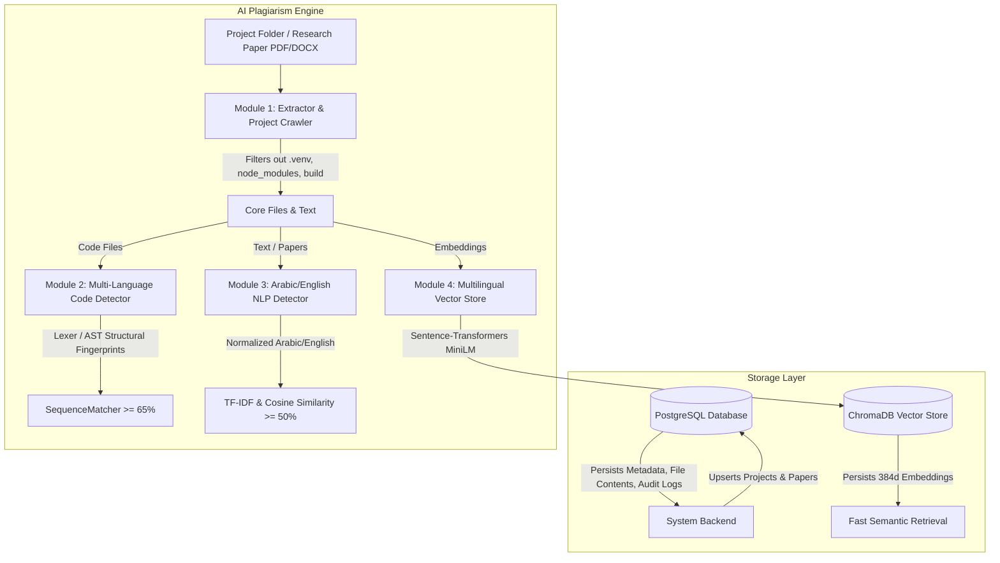

# Implementation Plan - Standalone Python AI & Plagiarism Detection Engine

A production-grade Python package (`plagiarism_engine`) providing multi-language code plagiarism detection, Arabic & English NLP text similarity analysis, document/research paper extraction, vector semantic search (ChromaDB), and local PostgreSQL integration for full persistence of projects, research papers, files, and plagiarism audit reports.

## System Architecture: PostgreSQL + ChromaDB + AI Engine



### Data Flow for New Research Papers & Projects:
1. **Cataloging & Persistence (PostgreSQL)**:
   - When a project or research paper is submitted to the system, its metadata (ID, title, author, upload date), file hierarchy, and raw extracted text are saved into PostgreSQL (`projects`, `papers`, `files`, `scan_results` tables).
2. **Semantic Vector Indexing (ChromaDB)**:
   - Paragraphs / sections / code modules are embedded into 384d vectors using `paraphrase-multilingual-MiniLM-L12-v2` and stored in ChromaDB with metadata referencing the `paper_id` or `project_id` in PostgreSQL.
3. **Plagiarism & Similarity Checking**:
   - **System-Wide Research Paper Check**: When a new research paper arrives, it is parsed via PDF/DOCX extractor, normalized (Arabic/English), and checked against:
     a) **ChromaDB**: Top-K semantic match across all indexed research papers in the system.
     b) **TF-IDF Engine**: Pairwise n-gram text similarity against all existing paper texts stored in the database.
   - **Multi-File Code Project Check**: Recursively crawls core code files, extracts Pygments token / Python AST fingerprints, and compares against existing projects in the system.

## Proposed Changes & Package Layout

### Environment & Dependencies
- Create local Python virtual environment `.venv`.
- `requirements.txt`:
  ```
  sentence-transformers>=2.2.2
  chromadb>=0.4.0
  scikit-learn>=1.2.0
  pypdf>=3.0.0
  python-docx>=0.8.11
  pygments>=2.14.0
  psycopg2-binary>=2.9.0
  ```

### Package Structure: `plagiarism_engine`

#### [NEW] `plagiarism_engine/__init__.py`
Exports top-level interface classes and helper functions:
- `FileExtractor`
- `CodePlagiarismDetector`
- `TextPlagiarismDetector`
- `MultilingualVectorStore`
- `PostgresStore` (Optional/Pluggable PostgreSQL integration)
- `normalize_arabic_text`

#### [NEW] `plagiarism_engine/extractor.py` (Module 1)
- PDF (`pypdf`) & DOCX (`python-docx`) research paper extractor.
- Raw text/code file loader with UTF-8 / CP1256 / Latin-1 multi-encoding fallback.
- `categorize_file(path)` -> `'code'` or `'text'`.
- `scan_project_directory(dir_path)`: Crawls full directory structures, filtering out `.venv`, `node_modules`, `__pycache__`, `.git`, `build`, `dist`, `target`, `bin`, `obj`, etc.

#### [NEW] `plagiarism_engine/code_detector.py` (Module 2)
- Pygments lexer tokenizer for Python, C++, Java, JS, TS, C#, Go, Rust, PHP, HTML/CSS.
- Strips variable names, comments, docstrings, and literals into generic structural fingerprints (`KEYWORD`, `OPERATOR`, `IDENTIFIER`, `STRING`, `NUMBER`).
- Python `ast` node structural representation mode.
- Pairwise code matcher & project-level multi-file scanner with 65% threshold.

#### [NEW] `plagiarism_engine/text_detector.py` (Module 3)
- `normalize_arabic_text(text)`: Removes Tashkeel, Tatweel/Kashida, normalizes Alef, Teh Marbuta, and Alef Maqsura.
- `TextPlagiarismDetector`: TF-IDF vectorization with character/word n-grams for Arabic & English. Pairwise cosine similarity with 50% threshold.

#### [NEW] `plagiarism_engine/vector_store.py` (Module 4)
- `MultilingualVectorStore`: `paraphrase-multilingual-MiniLM-L12-v2` + `chromadb` client with Cosine distance.
- Functions: `upsert_document`, `search_similar_documents`, `index_paper`, `index_project`.

#### [NEW] `plagiarism_engine/db.py` (PostgreSQL / Relational Persistence)
- PostgreSQL schema setup script / manager:
  - Table `projects` (`id`, `name`, `created_at`, `meta_info`)
  - Table `papers` (`id`, `title`, `author`, `created_at`, `extracted_text`)
  - Table `files` (`id`, `project_id`, `paper_id`, `relative_path`, `file_type`, `content_hash`, `content`)
  - Table `scan_reports` (`id`, `query_id`, `target_id`, `similarity_score`, `match_type`, `details`, `created_at`)
- Helper functions to save projects, save research papers, load papers for batch scanning, and store audit logs.

#### [NEW] `demo.py`
Comprehensive CLI demonstration script verifying:
1. Virtual environment setup and project crawler filtering out `.venv`, `node_modules`, etc.
2. Research paper extraction (PDF/DOCX) & Arabic NLP normalization and system-wide TF-IDF plagiarism scanning.
3. Multi-language code plagiarism comparison (C++, Java, Python AST) across project files.
4. ChromaDB semantic vector search across indexed papers & projects.
5. PostgreSQL schema initialization and data persistence workflow.

## Verification Plan

### Virtual Environment Setup & Installation
```powershell
powershell -Command 'python -m venv .venv; .\.venv\Scripts\pip install -r requirements.txt'
```

### Execution Verification
- Run `.\.venv\Scripts\python demo.py` to verify all 4 core modules + project scanner + PostgreSQL schema helper.
