# Secure-FEPRH: Master Technical Reference
## Secure Faculty of Engineering Project & Research Hub
### Complete Project Blueprint — Every Aspect, Algorithm, Stack, and Workflow

---

# Table of Contents

1. [Executive Summary](#1-executive-summary)
2. [Problem Statement & Motivation](#2-problem-statement--motivation)
3. [Project Scope & Objectives](#3-project-scope--objectives)
4. [System Architecture Overview](#4-system-architecture-overview)
5. [Complete Technology Stack](#5-complete-technology-stack)
6. [User Roles & RBAC Matrix](#6-user-roles--rbac-matrix)
7. [Subsystem 1: IAM & Biometric Authentication](#7-subsystem-1-iam--biometric-authentication)
8. [Subsystem 2: Smart Similarity & Plagiarism Detection](#8-subsystem-2-smart-similarity--plagiarism-detection)
9. [Subsystem 3: Secure Code Repository](#9-subsystem-3-secure-code-repository)
10. [Subsystem 4: Smart Attendance System](#10-subsystem-4-smart-attendance-system)
11. [Subsystem 5: Kanban & Task Management](#11-subsystem-5-kanban--task-management)
12. [Subsystem 6: Notifications & Alerts Engine](#12-subsystem-6-notifications--alerts-engine)
13. [Subsystem 7: Analytics Dashboard](#13-subsystem-7-analytics-dashboard)
14. [Database Schema & Entity Relationships](#14-database-schema--entity-relationships)
15. [API Architecture & Endpoint Map](#15-api-architecture--endpoint-map)
16. [Security Architecture](#16-security-architecture)
17. [Full Project Workflow (End-to-End)](#17-full-project-workflow-end-to-end)
18. [Deployment Strategy](#18-deployment-strategy)
19. [Testing Strategy](#19-testing-strategy)
20. [Future Enhancements](#20-future-enhancements)

---

# 1. Executive Summary

**Secure-FEPRH** is a zero-budget, software-only, enterprise-grade platform designed for the Faculty of Engineering and Technology (Computer & Control Engineering Department) at Ibb University. It serves as a centralized hub for managing the full lifecycle of graduation projects — from proposal submission and plagiarism checking, through development tracking, to final discussion and archiving.

The platform integrates three engineering disciplines:
- **Web Development** — React.js frontend, FastAPI backend, PostgreSQL database
- **Artificial Intelligence** — Computer Vision (face recognition, liveness detection, attendance) and NLP (Arabic text similarity, code plagiarism)
- **Cyber Security** — Biometric MFA, RBAC, JWT, encryption, rate limiting, input sanitization

---

# 2. Problem Statement & Motivation

| Problem | Impact | Secure-FEPRH Solution |
|:---|:---|:---|
| No digital archiving of projects | Vital code, simulations, and circuits are lost or stolen year after year | Encrypted, access-controlled digital repository |
| Repetition of project ideas | Students unknowingly (or intentionally) recycle ideas from previous batches | AI-powered similarity engine checks new proposals against the entire archive |
| No code plagiarism detection | Students copy code and rename variables to evade text-based checks | AST-based structural analysis and MOSS integration |
| Manual, error-prone attendance | Paper-based attendance during discussion sessions is unreliable | Computer vision face recognition for automated attendance |
| No continuous progress tracking | Supervisors only see final deliverables, not weekly effort | Built-in Kanban boards with sprint tracking |
| Weak authentication | Username/password alone is vulnerable to credential sharing | Biometric Face MFA with liveness detection |
| Zero budget for hardware | The department cannot purchase specialized equipment | Software-only solution using existing PCs and webcams |

---

# 3. Project Scope & Objectives

## 3.1 In Scope
- Biometric face authentication with liveness detection (anti-spoofing)
- Role-Based Access Control (Student, Supervisor, Department Head)
- Arabic and English text similarity detection for project proposals
- Code plagiarism detection via AST analysis
- Encrypted file repository for code and documents
- Automated attendance via face recognition during discussions
- Kanban task management for continuous evaluation
- Real-time notification system
- Analytics dashboard for department-level insights
- Secure REST API architecture

## 3.2 Out of Scope
- Mobile native applications (web-responsive only)
- Integration with university ERP or SIS systems
- Multi-faculty support (single department for MVP)
- Real-time video conferencing
- Hardware procurement (fingerprint readers, RFID, etc.)

---

# 4. System Architecture Overview

## 4.1 High-Level Architecture Diagram

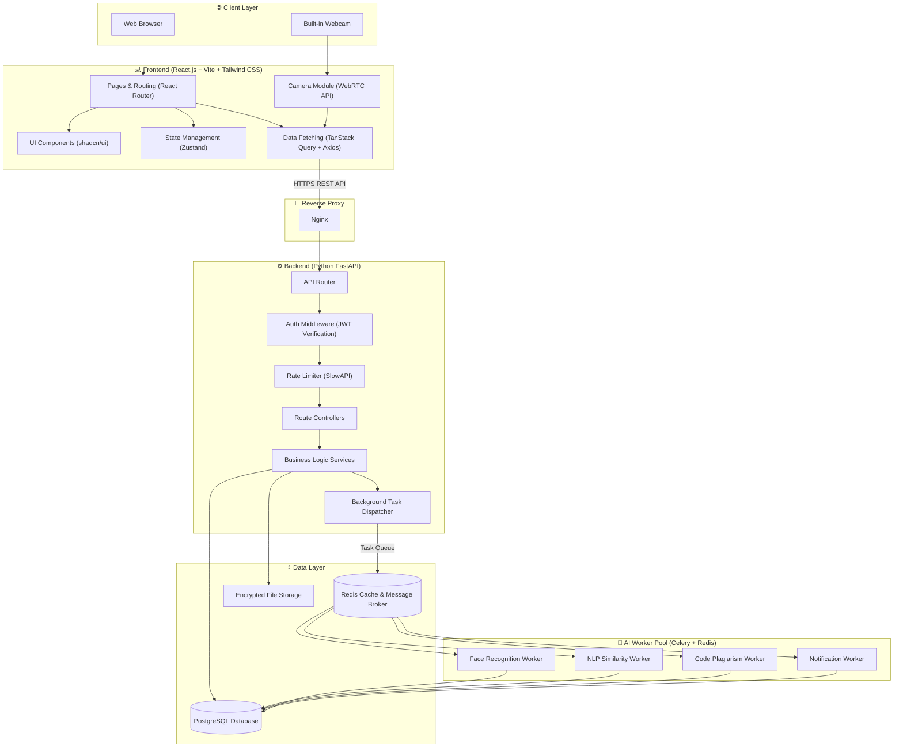

## 4.2 Component Interaction Flow

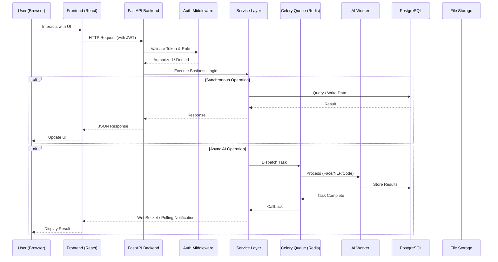

---

# 5. Complete Technology Stack

## 5.1 Frontend Stack

| Category | Technology | Version | Purpose |
|:---|:---|:---|:---|
| **Framework** | React.js | 18+ | Component-based UI library |
| **Build Tool** | Vite | 5+ | Fast HMR dev server, optimized production builds |
| **Language** | TypeScript | 5+ | Type safety, better IDE support, fewer runtime errors |
| **Routing** | React Router | v6 | Client-side page routing and protected routes |
| **Styling** | Tailwind CSS | v3 | Utility-first CSS framework for rapid styling |
| **UI Components** | shadcn/ui | Latest | Accessible, customizable component library |
| **State Management** | Zustand | v4 | Lightweight global state (auth, theme, user session) |
| **Server State** | TanStack Query (React Query) | v5 | Caching, background refetching, optimistic updates |
| **HTTP Client** | Axios | v1 | HTTP requests with interceptors for JWT refresh |
| **Drag & Drop** | @hello-pangea/dnd | Latest | Kanban board drag-and-drop functionality |
| **Charts** | Recharts | v2 | Analytics dashboard data visualization |
| **Camera** | WebRTC API (Native) | — | Access device camera for face authentication |
| **Forms** | React Hook Form + Zod | Latest | Performant form handling with schema validation |
| **Notifications UI** | Sonner | Latest | Toast notification display |
| **Date/Time** | date-fns | Latest | Date formatting and manipulation |
| **Icons** | Lucide React | Latest | Consistent icon set |

## 5.2 Backend Stack

| Category | Technology | Version | Purpose |
|:---|:---|:---|:---|
| **Framework** | FastAPI | 0.100+ | Async Python web framework with auto OpenAPI docs |
| **ASGI Server** | Uvicorn | Latest | High-performance async server |
| **ORM** | SQLAlchemy | v2 | Database interaction via Python objects |
| **Migrations** | Alembic | Latest | Database schema versioning and migrations |
| **Validation** | Pydantic | v2 | Request/response data validation and serialization |
| **Password Hashing** | PassLib (bcrypt) | Latest | Secure one-way password hashing |
| **JWT Tokens** | PyJWT | Latest | JSON Web Token generation and verification |
| **Rate Limiting** | SlowAPI | Latest | Endpoint-level rate limiting |
| **Background Tasks** | Celery | v5 | Distributed task queue for AI processing |
| **Message Broker** | Redis | v7 | Task queue broker + result backend + caching |
| **Email** | FastAPI-Mail | Latest | SMTP email for OTP fallback and notifications |
| **CORS** | FastAPI CORSMiddleware | Built-in | Cross-origin request handling |
| **File Handling** | python-multipart, aiofiles | Latest | Async file upload and storage |
| **Logging** | Loguru | Latest | Structured logging with rotation |
| **Testing** | Pytest + httpx | Latest | Unit and integration testing |

## 5.3 AI & Computer Vision Stack

| Category | Technology | Version | Purpose |
|:---|:---|:---|:---|
| **Image Processing** | OpenCV (opencv-python) | v4 | Webcam frame capture, image preprocessing |
| **Face Detection** | Dlib | v19 | HOG-based and CNN-based face detection |
| **Face Encoding** | face_recognition | Latest | Extract 128-dimensional face embeddings |
| **Liveness Detection** | MediaPipe (Face Mesh) | Latest | Real-time eye blink and head pose detection |
| **Deep Learning (Optional)** | PyTorch / ONNX Runtime | Latest | Run pre-trained anti-spoofing models |

## 5.4 NLP & Plagiarism Stack

| Category | Technology | Version | Purpose |
|:---|:---|:---|:---|
| **Arabic Preprocessing** | CAMeL Tools / Farasa | Latest | Arabic tokenization, stemming, lemmatization |
| **Arabic Stopwords** | NLTK (ISRI Stemmer) | Latest | Arabic stop-word removal and root extraction |
| **Feature Extraction** | Scikit-learn (TF-IDF) | Latest | Text vectorization for similarity computation |
| **Similarity Metric** | Scikit-learn (Cosine Similarity) | Latest | Measure textual similarity between vectors |
| **Semantic Similarity** | AraBERT (via HuggingFace) | Latest | Deep contextual Arabic text understanding |
| **Code Analysis** | Python `ast` module | Built-in | Parse Python source code into syntax trees |
| **Code Similarity** | MOSS API | — | Cross-language code plagiarism detection |

## 5.5 Database & Infrastructure Stack

| Category | Technology | Version | Purpose |
|:---|:---|:---|:---|
| **RDBMS** | PostgreSQL | v16 | Primary relational database |
| **Async Driver** | asyncpg | Latest | Non-blocking database communication |
| **Caching** | Redis | v7 | Session cache, rate-limit counters, task broker |
| **Containerization** | Docker + Docker Compose | Latest | Reproducible multi-service deployment |
| **Reverse Proxy** | Nginx | Latest | SSL termination, static file serving, load balancing |

## 5.6 Technology Decision Map

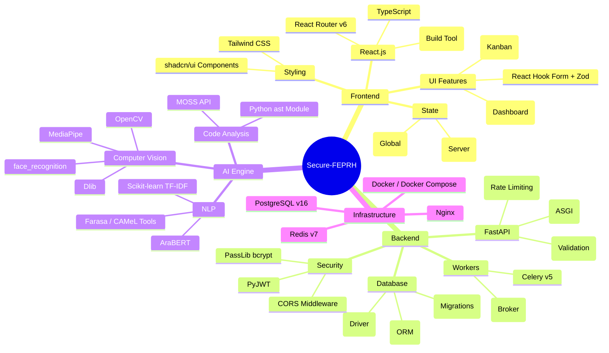

---

# 6. User Roles & RBAC Matrix

## 6.1 Role Definitions

| Role | Description | Population |
|:---|:---|:---|
| **Student** | Undergraduate engineering student working on a graduation project | Many (per batch) |
| **Supervisor** | Faculty member assigned to oversee and evaluate student projects | Several |
| **Department Head** | Head of Computer & Control Engineering, full administrative access | One |
| **System Admin** | Technical administrator managing the platform itself | One |

## 6.2 RBAC Permission Matrix

| Feature / Action | Student | Supervisor | Dept. Head | Admin |
|:---|:---:|:---:|:---:|:---:|
| Register & Enroll (Face) | ✅ | ✅ | ✅ | ✅ |
| Login via Face MFA | ✅ | ✅ | ✅ | ✅ |
| Submit Project Proposal | ✅ | ❌ | ❌ | ❌ |
| View Similarity Report (Own) | ✅ | ✅ | ✅ | ❌ |
| Upload Code / Files | ✅ | ❌ | ❌ | ❌ |
| View Code (Assigned Projects) | ❌ | ✅ | ✅ | ❌ |
| Approve / Reject Proposals | ❌ | ✅ | ✅ | ❌ |
| Manage Kanban Tasks | ✅ | ✅ | 👁️ View | ❌ |
| Grade Projects | ❌ | ✅ | ✅ | ❌ |
| View Attendance Logs | ❌ | ✅ | ✅ | ✅ |
| Access Analytics Dashboard | ❌ | ❌ | ✅ | ✅ |
| Manage Users & Roles | ❌ | ❌ | ❌ | ✅ |
| View Audit Logs | ❌ | ❌ | ✅ | ✅ |
| Download Archived Projects | ❌ | ✅ | ✅ | ❌ |

## 6.3 RBAC Access Flow

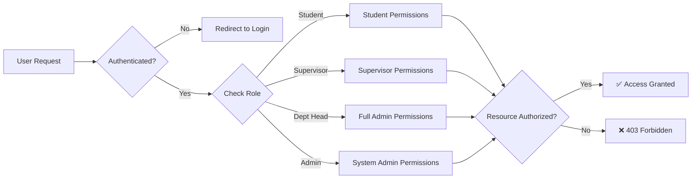

---

# 7. Subsystem 1: IAM & Biometric Authentication

## 7.1 Overview
The Identity and Access Management subsystem is the first line of defense. It implements Multi-Factor Authentication (MFA) combining traditional credentials with biometric face verification and liveness detection.

## 7.2 Authentication Flow

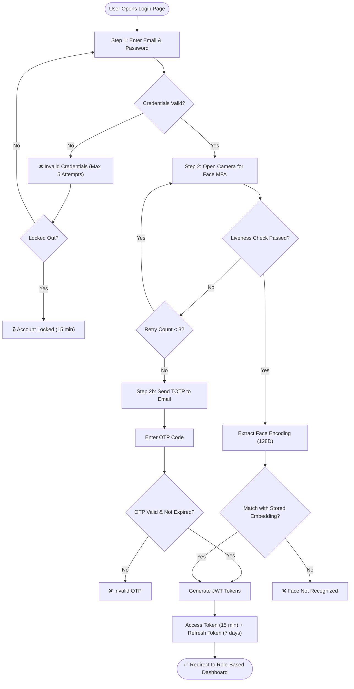

## 7.3 Algorithms & Methods

### 7.3.1 Face Detection — HOG + Linear SVM (Dlib)
- **Algorithm:** Histogram of Oriented Gradients (HOG)
- **How it works:**
  1. Convert the image to grayscale
  2. Compute gradient magnitude and direction for each pixel
  3. Divide the image into cells (8×8 pixels) and compute a histogram of gradient orientations
  4. Normalize histograms across blocks
  5. Feed the resulting feature vector into a pre-trained Linear SVM classifier to detect face regions
- **Output:** Bounding box coordinates for each detected face
- **Complexity:** O(n) per frame, runs at ~15-30 FPS on CPU

### 7.3.2 Face Encoding — Deep Metric Learning (ResNet)
- **Algorithm:** 128-dimensional face embedding via a pre-trained ResNet model
- **How it works:**
  1. Detect 68 facial landmarks (eyes, nose, mouth, jawline)
  2. Apply affine transformation to normalize face alignment
  3. Pass the aligned face through a deep CNN (ResNet-based) trained with triplet loss
  4. Output a 128-dimensional float vector (the "face encoding")
- **Mathematical representation:**
  
  $$f: \mathbb{R}^{150 \times 150 \times 3} \rightarrow \mathbb{R}^{128}$$

- **Comparison:** Euclidean distance between two encodings. Threshold = 0.6
  
  $$d(f_a, f_b) = \sqrt{\sum_{i=1}^{128}(f_{a_i} - f_{b_i})^2}$$
  
  If $d < 0.6$, the faces match.

### 7.3.3 Liveness Detection — Eye Aspect Ratio (MediaPipe)
- **Algorithm:** Eye Aspect Ratio (EAR) for blink detection
- **How it works:**
  1. Use MediaPipe Face Mesh to extract 468 3D facial landmarks in real-time
  2. Identify the 6 landmarks for each eye
  3. Compute the Eye Aspect Ratio:
  
  $$EAR = \frac{\|p_2 - p_6\| + \|p_3 - p_5\|}{2 \cdot \|p_1 - p_4\|}$$
  
  4. A blink is detected when EAR drops below a threshold (~0.21) for 2-3 consecutive frames
  5. Require the user to blink naturally to prove they are not a static photo/video
- **Additional checks:** Head pose estimation (yaw/pitch/roll) via MediaPipe to detect rotation

### 7.3.4 Password Hashing — bcrypt
- **Algorithm:** bcrypt with salt rounds = 12
- **How it works:**
  1. Generate a random 16-byte salt
  2. Run the Blowfish cipher key schedule 2^12 (4096) times
  3. Store the resulting hash: `$2b$12$<salt><hash>`
- **Properties:** One-way, computationally expensive to brute-force

### 7.3.5 JWT Token Structure
```
Header:  { "alg": "HS256", "typ": "JWT" }
Payload: { "sub": user_id, "role": "student", "exp": timestamp, "iat": timestamp }
Signature: HMACSHA256(base64(header) + "." + base64(payload), SECRET_KEY)
```

> [!CAUTION]
> **Biometric Privacy Rule:** NEVER store raw facial images in the database. Only the 128-dimensional float vector (face encoding) is stored. Even if the database is breached, no actual photos can be reconstructed from these vectors.

---

# 8. Subsystem 2: Smart Similarity & Plagiarism Detection

## 8.1 Overview
This subsystem detects plagiarism at two levels:
1. **Text Level** — Comparing project proposals, abstracts, and reports using NLP
2. **Code Level** — Comparing source code submissions using AST structural analysis

## 8.2 Text Similarity Pipeline

```mermaid
flowchart LR
    Input["New Proposal (Arabic/English)"] --> Lang{"Detect Language"}
    Lang -->|Arabic| ArabicPipe["Arabic Pipeline"]
    Lang -->|English| EnglishPipe["English Pipeline"]
    
    ArabicPipe --> ArabNorm["Normalize (Farasa)"]
    ArabNorm --> ArabTok["Tokenize"]
    ArabTok --> ArabStop["Remove Arabic Stop Words"]
    ArabStop --> ArabStem["Stem/Lemmatize (ISRI / CAMeL)"]
    
    EnglishPipe --> EngTok["Tokenize (NLTK)"]
    EngTok --> EngStop["Remove English Stop Words"]
    EngStop --> EngStem["Stem (Porter Stemmer)"]
    
    ArabStem --> TFIDF["TF-IDF Vectorization"]
    EngStem --> TFIDF
    TFIDF --> Cosine["Cosine Similarity vs. All Archived Projects"]
    Cosine --> Report["Similarity Report (Score + Matched Projects)"]
    Report --> Decision{"Score > Threshold?"}
    Decision -->|"> 70%"| Flag["🚩 Flag as Highly Similar"]
    Decision -->|"30-70%"| Review["⚠️ Needs Manual Review"]
    Decision -->|"< 30%"| Clear["✅ Likely Original"]
```

## 8.3 Text Similarity Algorithms

### 8.3.1 TF-IDF (Term Frequency — Inverse Document Frequency)
The core algorithm for converting text into numerical vectors.

**Term Frequency (TF):** How often a word appears in a document.

$$TF(t, d) = \frac{\text{Number of times term } t \text{ appears in document } d}{\text{Total number of terms in document } d}$$

**Inverse Document Frequency (IDF):** How unique/rare a word is across all documents.

$$IDF(t, D) = \log\left(\frac{|D|}{|\{d \in D : t \in d\}|}\right)$$

**TF-IDF Score:**

$$TFIDF(t, d, D) = TF(t, d) \times IDF(t, D)$$

### 8.3.2 Cosine Similarity
Measures the angle between two TF-IDF vectors in high-dimensional space.

$$\text{CosSim}(\vec{A}, \vec{B}) = \frac{\vec{A} \cdot \vec{B}}{\|\vec{A}\| \cdot \|\vec{B}\|} = \frac{\sum_{i=1}^{n} A_i B_i}{\sqrt{\sum_{i=1}^{n} A_i^2} \cdot \sqrt{\sum_{i=1}^{n} B_i^2}}$$

- Output range: `[0, 1]` where `1` = identical, `0` = completely different

### 8.3.3 Arabic-Specific NLP Steps
Standard English NLP libraries fail on Arabic due to:
- **Agglutination:** Arabic attaches prefixes/suffixes (e.g., "وبمدارسهم" = "and + in + schools + their")
- **Diacritics:** Optional marks change meaning
- **Root-based morphology:** Words derive from 3-letter roots

**Processing Pipeline:**
1. **Normalization:** Remove diacritics (tashkeel), normalize alef variants (أ إ آ → ا), normalize taa marbuta (ة → ه)
2. **Tokenization:** Split on whitespace and punctuation (Farasa handles clitics)
3. **Stop Word Removal:** Using Arabic stop-word lists from NLTK or custom lists
4. **Stemming/Lemmatization:** ISRI Stemmer (rule-based) or CAMeL Tools (neural-based)

### 8.3.4 Semantic Similarity with AraBERT (Advanced/Optional)

For catching paraphrased plagiarism where students rewrite sentences with synonyms:

1. Pass both texts through AraBERT to get contextual embeddings
2. Pool the token embeddings into a single sentence vector (mean pooling)
3. Compute cosine similarity between the sentence vectors

$$\text{SemanticSim}(S_1, S_2) = \text{CosSim}(\text{AraBERT}(S_1), \text{AraBERT}(S_2))$$

## 8.4 Code Plagiarism Pipeline

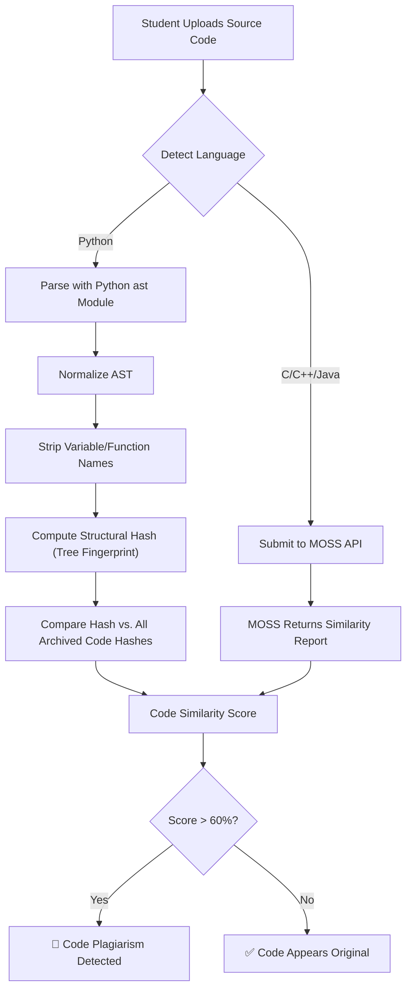

### 8.4.1 AST Comparison Algorithm (Python)
1. **Parse:** Use `ast.parse(source_code)` to generate an Abstract Syntax Tree
2. **Normalize:** Remove all identifier names (variable names, function names, class names) and replace with generic tokens
3. **Serialize:** Convert the normalized tree to a canonical string representation
4. **Hash:** Compute a SHA-256 hash of the serialized tree
5. **Compare:** Compare hashes; if identical → structural plagiarism. For partial matches, compute tree edit distance.

**Why this works:** Two programs that do the same thing with different variable names will produce identical normalized ASTs.

---

# 9. Subsystem 3: Secure Code Repository

## 9.1 Overview
A protected digital archive where students upload their project files (source code, simulations, documentation). Access is controlled by the RBAC system.

## 9.2 File Upload & Storage Flow

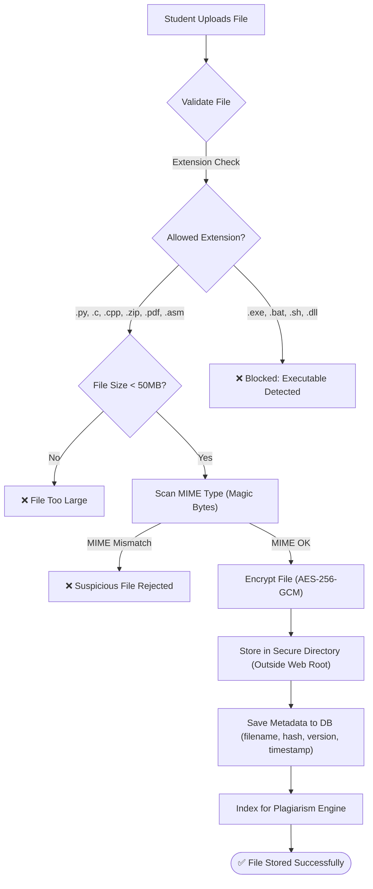

## 9.3 File Security Measures

| Measure | Implementation | Purpose |
|:---|:---|:---|
| **Extension Whitelist** | `.py`, `.c`, `.cpp`, `.h`, `.java`, `.asm`, `.zip`, `.pdf`, `.docx`, `.pptx` | Block executables and scripts |
| **MIME Type Verification** | `python-magic` library checks file magic bytes | Prevent renamed executables |
| **File Size Limit** | 50 MB per file, 200 MB per project | Prevent storage abuse |
| **Encryption at Rest** | AES-256-GCM via `cryptography` library | Protect stored files |
| **Hashing** | SHA-256 hash of every uploaded file | Integrity verification, deduplication |
| **Versioning** | Each upload creates a new version record | Full history, rollback capability |
| **Access Logging** | Every download/view creates an audit log entry | Accountability and traceability |

---

# 10. Subsystem 4: Smart Attendance System

## 10.1 Overview
During graduation project discussion sessions, the platform uses the room's existing camera (laptop/PC webcam) to automatically detect and record the attendance of students and examiners.

## 10.2 Attendance Workflow

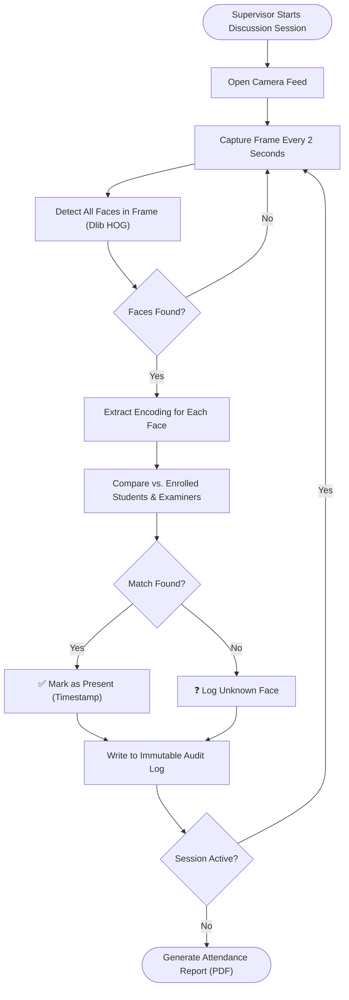

## 10.3 Attendance Algorithm Details
1. **Multi-face detection:** Process each frame to find all faces simultaneously
2. **Batch encoding:** Extract 128D vectors for all detected faces in a single pass
3. **KNN matching:** Use a K-Nearest Neighbors model (k=1) with a distance threshold of 0.6 to match detected faces against enrolled face encodings
4. **Temporal smoothing:** A person is marked "Present" only if recognized in at least 3 frames across a 30-second window (prevents false positives from momentary misdetection)
5. **Audit trail:** Each recognition event logs: `session_id`, `user_id`, `timestamp`, `confidence_score`, `frame_number`

---

# 11. Subsystem 5: Kanban & Task Management

## 11.1 Overview
A built-in agile project management tool that allows supervisors to continuously monitor student progress throughout the semester, not just at the final submission.

## 11.2 Kanban Data Model

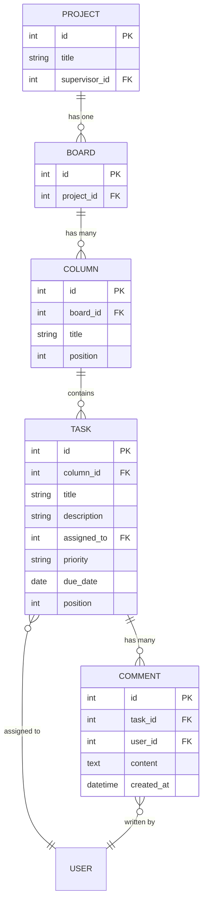

## 11.3 Kanban Workflow

```mermaid
statediagram-v2
    [*] --> Backlog
    Backlog --> ToDo: Assigned to Sprint
    ToDo --> InProgress: Student Starts Work
    InProgress --> Review: Student Requests Review
    Review --> InProgress: Supervisor Requests Changes
    Review --> Done: Supervisor Approves
    Done --> [*]
```

**Columns (Default):**
| Column | Description |
|:---|:---|
| **Backlog** | All tasks that need to be done eventually |
| **To Do** | Tasks assigned to the current sprint/week |
| **In Progress** | Tasks actively being worked on |
| **Review** | Tasks awaiting supervisor feedback |
| **Done** | Completed and approved tasks |

---

# 12. Subsystem 6: Notifications & Alerts Engine

## 12.1 Overview
A proactive communication system that keeps all stakeholders informed via in-app notifications and email alerts.

## 12.2 Notification Events

| Event | Recipients | Channel | Priority |
|:---|:---|:---|:---|
| Proposal submitted for review | Supervisor | In-App + Email | Normal |
| Similarity report generated | Student + Supervisor | In-App | Normal |
| Proposal approved/rejected | Student | In-App + Email | High |
| New code version uploaded | Supervisor | In-App | Normal |
| Supervisor left feedback | Student | In-App + Email | Normal |
| Submission deadline approaching (48h) | Student | In-App + Email | High |
| Submission deadline approaching (24h) | Student | In-App + Email | Critical |
| Failed Face MFA attempt (3+ times) | Admin + User | In-App + Email | Critical |
| Discussion session scheduled | All project members | In-App + Email | High |
| Kanban task assigned | Student | In-App | Normal |
| Attendance report generated | Supervisor | In-App | Normal |

## 12.3 Notification Architecture

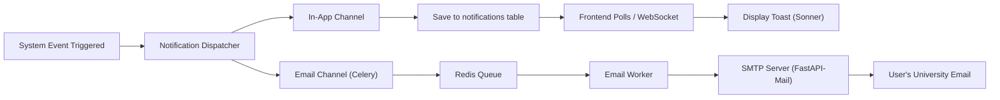

---

# 13. Subsystem 7: Analytics Dashboard

## 13.1 Overview
A visual analytics panel accessible only to the Department Head, providing data-driven insights into the department's projects.

## 13.2 Dashboard Metrics & Visualizations

| Metric | Chart Type | Data Source |
|:---|:---|:---|
| Projects per academic year | Bar Chart | `projects` table |
| Projects by domain (AI, IoT, Web, etc.) | Pie Chart | `projects.domain` field |
| Most used programming languages | Horizontal Bar | `project_files.extension` |
| Average similarity score per year | Line Chart | `similarity_reports.score` |
| High-similarity flags trend | Area Chart | `similarity_reports` where score > 0.7 |
| Supervisor workload distribution | Stacked Bar | `projects.supervisor_id` |
| Attendance rates per session | Grouped Bar | `attendance_logs` |
| Active vs. completed projects | Donut Chart | `projects.status` |
| Task completion rates (Kanban) | Progress Bars | `tasks.column_id` |

## 13.3 Dashboard Layout

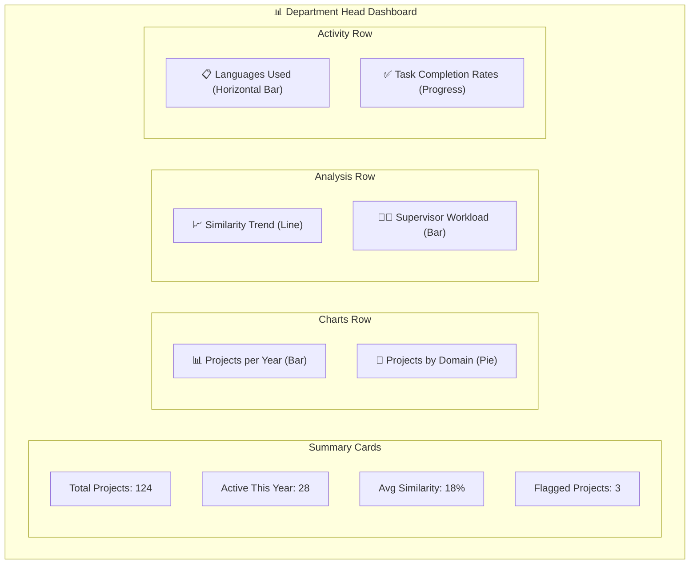

---

# 14. Database Schema & Entity Relationships

## 14.1 Complete ER Diagram

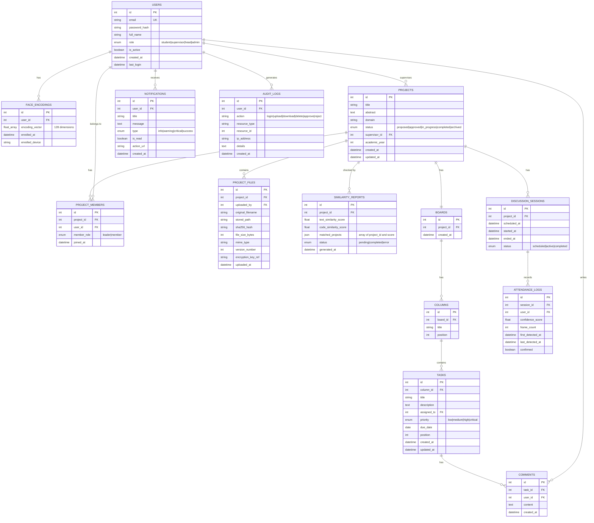

## 14.2 Table Summary

| Table | Purpose | Estimated Rows (per year) |
|:---|:---|:---|
| `users` | All platform users | ~200 |
| `face_encodings` | Biometric vectors (128D) | ~200 |
| `projects` | Graduation project records | ~50 |
| `project_members` | Student-project associations | ~150 |
| `project_files` | Uploaded code/docs with versions | ~500 |
| `similarity_reports` | Text & code plagiarism results | ~50 |
| `boards` | Kanban boards (one per project) | ~50 |
| `columns` | Board columns | ~250 |
| `tasks` | Individual tasks | ~1000 |
| `comments` | Supervisor/student comments on tasks | ~3000 |
| `discussion_sessions` | Scheduled defense sessions | ~50 |
| `attendance_logs` | Face recognition attendance records | ~300 |
| `notifications` | In-app notification records | ~5000 |
| `audit_logs` | Security and action audit trail | ~10000 |

---

# 15. API Architecture & Endpoint Map

## 15.1 API Design Principles
- **RESTful** resource-based URLs
- **Versioned** under `/api/v1/`
- **JSON** request/response format
- **JWT Bearer** authentication on all protected routes
- **Pydantic** models for request validation and response serialization
- **HTTP Status Codes:** 200 (OK), 201 (Created), 400 (Bad Request), 401 (Unauthorized), 403 (Forbidden), 404 (Not Found), 429 (Rate Limited), 500 (Server Error)

## 15.2 Endpoint Map

### Authentication & IAM
| Method | Endpoint | Description | Auth |
|:---|:---|:---|:---|
| `POST` | `/api/v1/auth/register` | Register new user | ❌ |
| `POST` | `/api/v1/auth/login` | Login (email + password) | ❌ |
| `POST` | `/api/v1/auth/face-verify` | Verify face for MFA | 🔑 Partial |
| `POST` | `/api/v1/auth/face-enroll` | Enroll face encoding | 🔑 |
| `POST` | `/api/v1/auth/otp/send` | Send TOTP to email (fallback) | 🔑 Partial |
| `POST` | `/api/v1/auth/otp/verify` | Verify TOTP code | 🔑 Partial |
| `POST` | `/api/v1/auth/refresh` | Refresh access token | 🔑 Refresh |
| `POST` | `/api/v1/auth/logout` | Invalidate tokens | 🔑 |

### Users
| Method | Endpoint | Description | Auth |
|:---|:---|:---|:---|
| `GET` | `/api/v1/users/me` | Get current user profile | 🔑 |
| `PUT` | `/api/v1/users/me` | Update own profile | 🔑 |
| `GET` | `/api/v1/users` | List all users (Admin) | 🔑 Admin |
| `PATCH` | `/api/v1/users/{id}/role` | Change user role (Admin) | 🔑 Admin |
| `DELETE` | `/api/v1/users/{id}` | Deactivate user (Admin) | 🔑 Admin |

### Projects
| Method | Endpoint | Description | Auth |
|:---|:---|:---|:---|
| `POST` | `/api/v1/projects` | Submit new project proposal | 🔑 Student |
| `GET` | `/api/v1/projects` | List projects (filtered by role) | 🔑 |
| `GET` | `/api/v1/projects/{id}` | Get project details | 🔑 |
| `PATCH` | `/api/v1/projects/{id}/status` | Approve/reject proposal | 🔑 Supervisor |
| `GET` | `/api/v1/projects/{id}/members` | List project members | 🔑 |
| `POST` | `/api/v1/projects/{id}/members` | Add member to project | 🔑 Student |

### Files & Repository
| Method | Endpoint | Description | Auth |
|:---|:---|:---|:---|
| `POST` | `/api/v1/projects/{id}/files` | Upload file (with version) | 🔑 Student |
| `GET` | `/api/v1/projects/{id}/files` | List all files & versions | 🔑 |
| `GET` | `/api/v1/files/{file_id}/download` | Download a specific file | 🔑 Supervisor+ |
| `DELETE` | `/api/v1/files/{file_id}` | Delete a file version | 🔑 Student |

### Similarity & Plagiarism
| Method | Endpoint | Description | Auth |
|:---|:---|:---|:---|
| `POST` | `/api/v1/projects/{id}/check-similarity` | Trigger similarity check | 🔑 |
| `GET` | `/api/v1/projects/{id}/similarity-report` | Get similarity report | 🔑 |

### Kanban & Tasks
| Method | Endpoint | Description | Auth |
|:---|:---|:---|:---|
| `GET` | `/api/v1/projects/{id}/board` | Get project Kanban board | 🔑 |
| `POST` | `/api/v1/boards/{id}/columns` | Add column | 🔑 |
| `PATCH` | `/api/v1/columns/{id}` | Update/reorder column | 🔑 |
| `POST` | `/api/v1/columns/{id}/tasks` | Create task | 🔑 |
| `PATCH` | `/api/v1/tasks/{id}` | Update task (title, column, position) | 🔑 |
| `DELETE` | `/api/v1/tasks/{id}` | Delete task | 🔑 |
| `POST` | `/api/v1/tasks/{id}/comments` | Add comment to task | 🔑 |

### Attendance & Sessions
| Method | Endpoint | Description | Auth |
|:---|:---|:---|:---|
| `POST` | `/api/v1/sessions` | Create discussion session | 🔑 Supervisor |
| `POST` | `/api/v1/sessions/{id}/start` | Start attendance capture | 🔑 Supervisor |
| `POST` | `/api/v1/sessions/{id}/stop` | Stop attendance capture | 🔑 Supervisor |
| `GET` | `/api/v1/sessions/{id}/attendance` | Get attendance report | 🔑 Supervisor+ |

### Analytics
| Method | Endpoint | Description | Auth |
|:---|:---|:---|:---|
| `GET` | `/api/v1/analytics/overview` | Summary cards data | 🔑 Head |
| `GET` | `/api/v1/analytics/projects-by-year` | Projects per year chart | 🔑 Head |
| `GET` | `/api/v1/analytics/domains` | Projects by domain | 🔑 Head |
| `GET` | `/api/v1/analytics/languages` | Languages distribution | 🔑 Head |
| `GET` | `/api/v1/analytics/similarity-trends` | Similarity scores over time | 🔑 Head |
| `GET` | `/api/v1/analytics/supervisor-workload` | Supervisor workload | 🔑 Head |

### Notifications
| Method | Endpoint | Description | Auth |
|:---|:---|:---|:---|
| `GET` | `/api/v1/notifications` | Get user's notifications | 🔑 |
| `PATCH` | `/api/v1/notifications/{id}/read` | Mark as read | 🔑 |
| `PATCH` | `/api/v1/notifications/read-all` | Mark all as read | 🔑 |

---

# 16. Security Architecture

## 16.1 Security Layers Overview

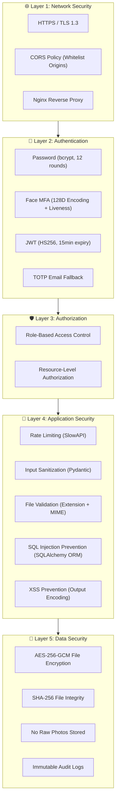

## 16.2 Threat Model

| Threat | Attack Vector | Mitigation |
|:---|:---|:---|
| **Brute Force Login** | Automated password guessing | Rate limiting (5 attempts/min), account lockout (15 min) |
| **Credential Sharing** | Students share passwords | Face MFA required as second factor |
| **Photo Spoofing** | Holding up a photo/video of someone | Liveness detection (blink + head pose) |
| **SQL Injection** | Malicious input in forms | SQLAlchemy ORM, Pydantic validation |
| **XSS** | Malicious scripts in text fields | Output encoding, Content Security Policy |
| **CSRF** | Cross-site forged requests | SameSite cookies, CORS whitelist |
| **File Upload Malware** | Uploading executables disguised as code | Extension whitelist + MIME verification |
| **Data Breach** | Database compromise | Face encodings only (no photos), encrypted files |
| **Session Hijacking** | Stealing JWT tokens | Short-lived tokens (15 min), HTTPS only, httpOnly cookies |
| **Privilege Escalation** | Student accessing admin features | Server-side RBAC checks on every endpoint |

---

# 17. Full Project Workflow (End-to-End)

## 17.1 Complete Academic Year Lifecycle

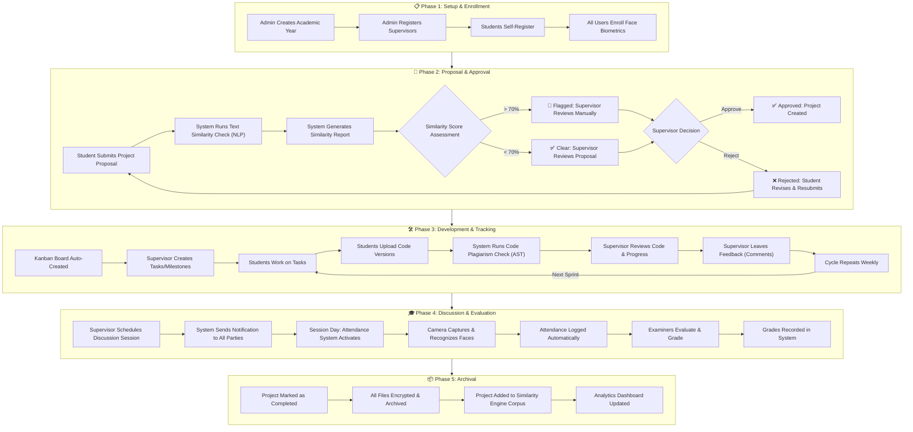

## 17.2 User Login Journey (Detailed)

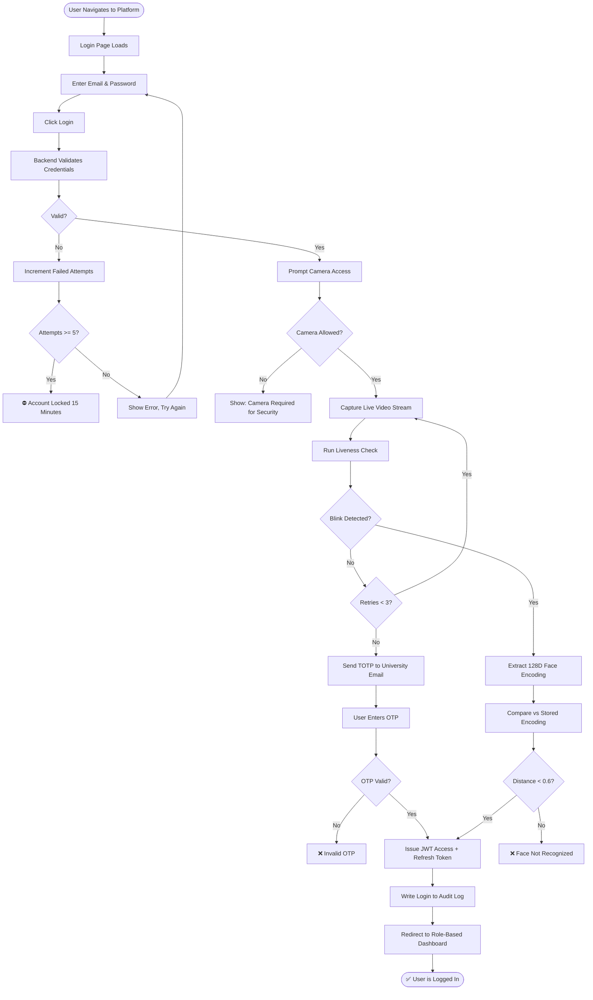

## 17.3 File Upload Journey

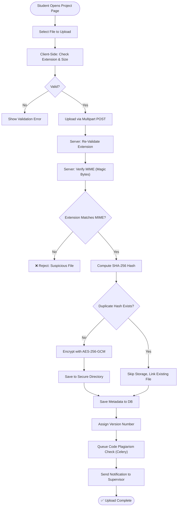

---

# 18. Deployment Strategy

## 18.1 Docker Compose Architecture

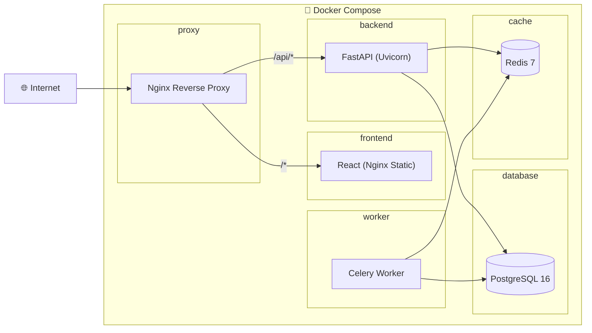

## 18.2 Docker Compose Services

```yaml
# docker-compose.yml (Conceptual)
services:
  proxy:      # Nginx — port 80/443
  frontend:   # React build served by Nginx
  backend:    # FastAPI + Uvicorn — port 8000
  worker:     # Celery worker (AI tasks)
  database:   # PostgreSQL 16 — port 5432
  cache:      # Redis 7 — port 6379
```

## 18.3 Deployment Environments

| Environment | Purpose | Database | Hosting |
|:---|:---|:---|:---|
| **Local Dev** | Developer machines | SQLite / Local PostgreSQL | `localhost` |
| **Staging** | Testing before presentation | PostgreSQL (Docker) | University Server |
| **Production** | Live platform for the department | PostgreSQL (Docker) | University Server |

---

# 19. Testing Strategy

## 19.1 Testing Pyramid

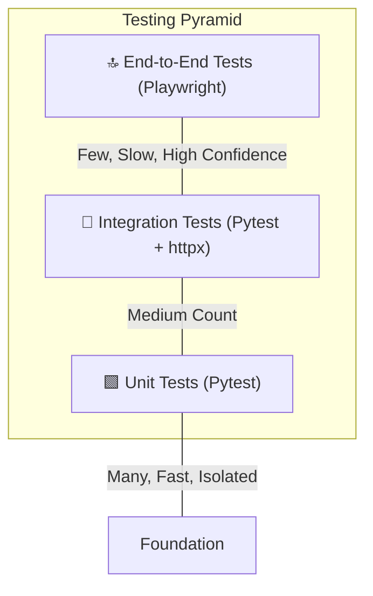

## 19.2 Test Coverage Targets

| Area | Tool | Coverage Target | Examples |
|:---|:---|:---|:---|
| **Backend Unit Tests** | Pytest | 80%+ | Service functions, utility helpers, validators |
| **API Integration Tests** | Pytest + httpx | All endpoints | Auth flow, RBAC enforcement, CRUD operations |
| **AI Model Tests** | Pytest | Core functions | Face encoding accuracy, NLP similarity correctness |
| **Frontend Unit Tests** | Vitest + React Testing Library | Key components | Form validation, state management |
| **E2E Tests** | Playwright | Critical paths | Login flow, file upload, proposal submission |
| **Security Tests** | Manual + OWASP ZAP | OWASP Top 10 | SQL injection, XSS, CSRF, broken auth |

---

# 20. Future Enhancements

| Enhancement | Description | Complexity |
|:---|:---|:---|
| **Mobile App** | React Native app for notifications and quick actions | High |
| **Multi-Faculty Support** | Extend to other departments (Electrical, Civil, etc.) | Medium |
| **University SSO Integration** | Login via university LDAP/Active Directory | Medium |
| **AI Chatbot Assistant** | Answer student FAQs about deadlines, requirements | Medium |
| **Peer Review System** | Students review each other's code | Low |
| **Automated Grading Rubric** | Supervisor fills structured rubric that auto-computes grades | Low |
| **Video Recording of Discussions** | Record and archive defense sessions | High |
| **Multi-Language Code Support** | Expand AST analysis beyond Python to C++, Java natively | Medium |
| **Plagiarism Cross-University Check** | Compare against other universities' databases | High |
| **Progressive Web App (PWA)** | Offline-capable installable web app | Low |

---

> **Document Version:** 1.0  
> **Last Updated:** July 2026  
> **Authors:** Secure-FEPRH Development Team  
> **Status:** Master Reference — Ready for Academic Review
