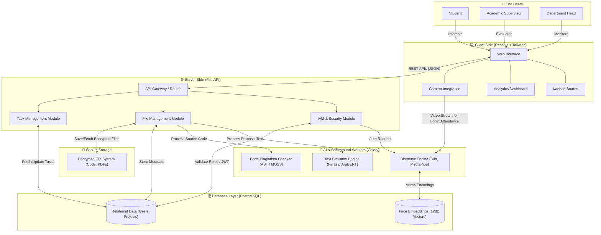

# System Architecture Diagram (Secure-FEPRH)

This document contains the high-level system architecture for the **Secure-FEPRH** platform. 
The diagram below illustrates how the different users, frontend, backend, AI modules, and databases interact with each other.

### Flow Explanation for the Doctor:

1. **User Interaction**: Students, Supervisors, and the Department Head interact with the **React.js Frontend**. Depending on their RBAC role, they access different modules (Kanban boards, Dashboards, File Uploads).
2. **Camera Integration**: When a user attempts to log in or mark attendance, the frontend captures the video stream and sends it directly to the **Biometric Engine**.
3. **Backend API Gateway**: All standard requests (fetching data, submitting forms) go through the **FastAPI Gateway**, which routes them to the appropriate logic modules.
4. **IAM (Identity & Access Management)**: Handles token generation (JWT) and validates user permissions against the **PostgreSQL Database**.
5. **AI Workers (Background Tasks)**: 
   - Heavy tasks like **Plagiarism Checking (NLP & AST)** are offloaded to background workers so the main server doesn't freeze.
   - The **Biometric Engine** handles Face Recognition and Liveness Detection.
6. **Data Storage**:
   - Structured data (Users, Roles, Project Names) is saved in the **Relational DB**.
   - The highly sensitive **Face Encodings** (mathematical vectors, not raw photos) have their own secure tables.
   - Actual project files and source codes are stored in the **Encrypted File System**.
