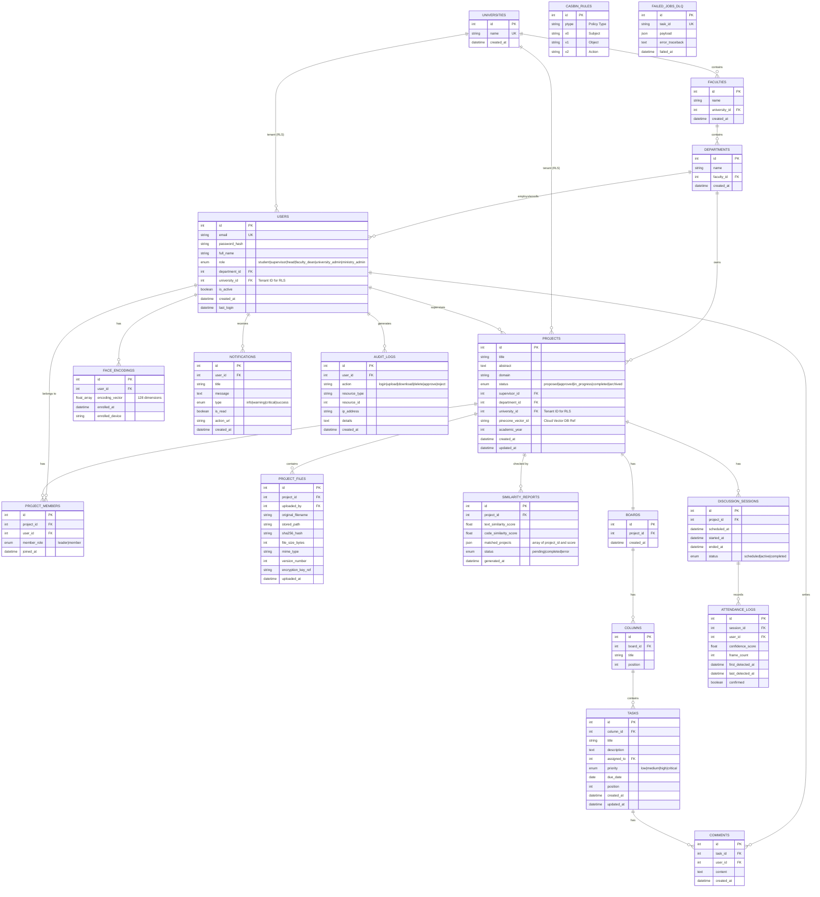

# Secure-FEPRH Database Schema Overview

This document provides a comprehensive overview of the entire database schema for the Secure-FEPRH project, upgraded for National-Scale Enterprise architecture.

## 1. Entity-Relationship (ER) Diagram

The following diagram illustrates how all the tables in the system are connected:

## 2. Core Modules & Tables Summary

### The Multi-Tenant Hierarchy (National Scale)
*   **`UNIVERSITIES`**, **`FACULTIES`**, **`DEPARTMENTS`**: The strict structural hierarchy of the Ministry of Higher Education.
*   **Tenant Isolation**: Both `USERS` and `PROJECTS` now possess a `university_id` column. This acts as the anchor for **PostgreSQL Row-Level Security (RLS)**, mathematically guaranteeing that one university cannot access another's data.

### Identity, Access & Security
*   **`USERS`**: The central entity for all platform users. Roles map to the national hierarchy (Student -> Supervisor -> Head -> Dean -> Univ Admin -> Ministry).
*   **`FACE_ENCODINGS`**: Stores the 128-dimensional biometric vectors used for Face MFA. *Crucially, raw images are not stored here for privacy.*
*   **`CASBIN_RULES`**: The dynamic policy engine table. Defines complex RBAC/ABAC rules (e.g., grading permissions, dashboard visibility) without hardcoding logic in Python.
*   **`AUDIT_LOGS`**: An immutable ledger of critical actions (logins, uploads, deletions) used for security and accountability.

### Project & AI Management
*   **`PROJECTS`**: Contains core project metadata. Notably includes `pinecone_vector_id`, linking this SQL row to its corresponding highly-compressed AI embedding in the **Pinecone Cloud Vector Database** for instant national plagiarism scans.
*   **`PROJECT_MEMBERS`**: A junction table linking multiple students to a project (supports team leaders and members).
*   **`PROJECT_FILES`**: The secure code repository tracking file uploads, hashes, sizes, version numbers, and AES-256 encryption key references.
*   **`SIMILARITY_REPORTS`**: Stores the AI-generated plagiarism scores (text and code) retrieved from the Pinecone vector math engine.

### Kanban & Task Tracking
*   **`BOARDS`**, **`COLUMNS`**, **`TASKS`**, **`COMMENTS`**: Standard Agile workflow components mapped 1-to-1 with a project for real-time WebSocket updates.

### Smart Attendance
*   **`DISCUSSION_SESSIONS`**: Represents a scheduled defense or presentation session for a project.
*   **`ATTENDANCE_LOGS`**: The output of the Computer Vision AI. Records when a face was detected, the confidence score, and confirmation of presence.

### DevOps & Background Queues
*   **`FAILED_JOBS_DLQ`**: The Dead-Letter Queue. If a Celery/RabbitMQ background task (like sending emails or AI parsing) fails completely, its payload and error trace are saved here for Ministry Admin review.
